# CharmDojo - Product Requirements Document v1

**Document Status:** Planning  
**Created:** October 23, 2025  
**Last Updated:** October 23, 2025  
**Owner:** Product Team  

---

## Table of Contents

1. [Executive Summary](#executive-summary)
2. [Problem & Solution](#problem--solution)
3. [Market Analysis](#market-analysis)
4. [User Personas & Pain Points](#user-personas--pain-points)
5. [User Journey & Flows](#user-journey--flows)
6. [User Stories](#user-stories)
7. [Technical Architecture](#technical-architecture)
8. [API Specifications](#api-specifications)
9. [Data Models](#data-models)
10. [Technology Stack](#technology-stack)
11. [Implementation Phases](#implementation-phases)
12. [Risks & Mitigations](#risks--mitigations)
13. [Success Metrics](#success-metrics)
14. [Appendices](#appendices)

---

## Executive Summary

### Product Vision

CharmDojo is a gamified dating conversation training web application that helps men develop their texting skills through realistic AI-powered chat simulations with virtual women. Marketed as a "dating app conversation trainer," it provides a safe, judgment-free environment to practice flirting and conversational techniques.

### Core Value Proposition

- **Realistic Practice:** AI-generated characters with authentic conversational patterns and emotional responses
- **Instant Feedback:** Dynamic success meter shows real-time conversation performance
- **Gamified Learning:** Win/lose mechanics with rewarding outcomes motivate continued practice
- **Safe Environment:** Practice without fear of rejection or social consequences

### Target Market

Primary: Men aged 18-35 who use dating apps and want to improve their conversation skills  
Secondary: Dating coaches, social skills trainers looking for practice tools

### Business Model

- Freemium SaaS model with limited free rounds
- Premium subscription for unlimited gameplay
- Potential for coaching/tutorial content upsells

### Key Differentiators

1. **Real-time AI simulation** vs. static tutorials
2. **Visual & audio rewards** vs. text-only feedback
3. **Dynamic difficulty** based on AI girl personality
4. **Safe practice environment** vs. real-world trial and error

---

## Problem & Solution

### Problem Statement

**Primary Problem:**  
Many men struggle with initiating and maintaining engaging conversations on dating apps, leading to low match response rates, boring conversations, and missed romantic opportunities.

**Supporting Problems:**
1. **Lack of Practice Environment:** No safe space to practice without real-world consequences
2. **No Constructive Feedback:** Trial-and-error approach with real matches wastes opportunities
3. **Fear of Rejection:** Anxiety prevents experimentation with different conversation styles
4. **Limited Learning Resources:** Static articles and videos don't provide interactive practice
5. **Unclear Success Patterns:** Users don't understand what messaging behaviors lead to success

### Current Alternatives & Limitations

| Alternative | Limitations |
|-------------|-------------|
| Dating coaches | Expensive ($100-500/session), can't practice in real-time |
| Online articles/videos | Static content, no feedback loop, no personalization |
| Trial & error on real apps | Wastes matches, damages confidence, slow learning |
| Friends' advice | Subjective, inconsistent, lacks structure |

### Solution Overview

CharmDojo provides an **AI-powered dating conversation simulator** that:

1. **Simulates realistic dating app conversations** with AI-generated women
2. **Provides real-time feedback** through a dynamic success meter (0-100%)
3. **Creates consequences** for poor conversation choices (instant failure at 0%)
4. **Rewards successful seduction** with visual and audio gratification
5. **Enables unlimited practice** without real-world social costs

### How It Works (30-Second Version)

1. User selects from 3 AI-generated girl profiles
2. Initiates conversation in a Tinder-like chat interface
3. Success meter adjusts (±1-8%) based on message quality
4. Win condition: Reach 100% success → Receive reward (text + voice + image)
5. Loss condition: Drop to ≤5% → Game over, try again
6. Iterate and improve conversational skills over multiple rounds

### Success Criteria

**User Success:**
- Users show measurable improvement in conversation quality over time
- Users report increased confidence in real dating app conversations
- Users successfully transfer skills to real-world dating scenarios

**Business Success:**
- High engagement (avg. 5+ rounds per session)
- Strong conversion to premium (target 15% free-to-paid conversion)
- Positive user sentiment and viral growth

---

## Market Analysis

### Market Size & Opportunity

**Dating App Market:**
- 366M+ dating app users worldwide (2024)
- $3.4B+ global dating app revenue (2024)
- 75% of users are male (primary target demographic)
- 40% of users report difficulty initiating conversations

**Adjacent Markets:**
- Online dating coaching: $1.2B industry
- Self-improvement courses: $13B market
- AI chatbot/companion apps: Growing $500M+ market

### Competitive Landscape

**Direct Competitors:**

| Competitor | Strengths | Weaknesses | Differentiation |
|------------|-----------|------------|-----------------|
| **Rizz GPT** | AI coaching, message suggestions | Static advice, no simulation | CharmDojo offers full conversation simulation |
| **YourMove AI** | Screenshot analysis, message writing | No practice environment | CharmDojo provides interactive practice |
| **Dating Coach Services** | Personalized human feedback | Expensive, not scalable | CharmDojo is affordable + always available |

**Indirect Competitors:**
- Character.AI (general AI chat, not dating-focused)
- Replika (AI companion, not skill-building)
- YouTube dating coaches (passive content consumption)

### Market Trends

**Favorable Trends:**
1. ✅ **AI Acceptance:** Growing comfort with AI for personal development
2. ✅ **Gamification:** Proven engagement driver in education apps
3. ✅ **Remote Learning:** Shift toward digital skill-building tools
4. ✅ **Dating App Saturation:** Users seek edge in competitive market

**Challenges:**
1. ⚠️ **AI Safety Concerns:** NSFW content generation requires careful moderation
2. ⚠️ **Market Sensitivity:** Dating advice niche can be controversial
3. ⚠️ **Content Moderation:** Need robust systems to prevent misuse

### Target Market Segments

**Primary Segment: "The Frustrated Swiper"**
- Demographics: Men 22-32, urban, college-educated
- Behavior: Active on dating apps, low success rate
- Pain point: Gets matches but conversations go nowhere
- Willingness to pay: Moderate-High ($10-30/month)

**Secondary Segment: "The Comeback User"**
- Demographics: Men 28-40, recently single, rusty social skills
- Behavior: Re-entering dating market after relationship
- Pain point: Dating norms have changed, feels out of touch
- Willingness to pay: High ($20-50/month)

**Tertiary Segment: "The Social Skills Builder"**
- Demographics: Men 18-25, introverted, limited dating experience
- Behavior: Wants to improve before trying real apps
- Pain point: Anxiety about first impressions
- Willingness to pay: Low-Moderate ($5-15/month)

---

## User Personas & Pain Points

### Persona 1: "Alex the Awkward Texter"

**Demographics:**
- Age: 24
- Occupation: Software Engineer
- Location: Austin, TX
- Tech-savvy, introverted, analytical

**Current Behavior:**
- Gets 3-5 matches/week on Tinder/Bumble
- 80% of conversations die after 3-4 messages
- Overthinks messages, takes 10+ minutes to reply
- Avoids playful/flirty language, stays "safe"

**Pain Points:**
- 😰 "I never know what to say after 'hey, how's your weekend?'"
- 😰 "I'm afraid of saying something wrong and getting unmatched"
- 😰 "I can't tell if she's interested or just being polite"
- 😰 "By the time I think of a good response, she's moved on"

**Goals:**
- Learn to be more playful and confident in text
- Reduce anxiety around messaging
- Get more dates from existing matches

**Success Metrics:**
- Reduce message response time by 50%
- Increase conversation-to-date conversion by 3x
- Feel confident in 80% of interactions

---

### Persona 2: "Marcus the Comeback King"

**Demographics:**
- Age: 31
- Occupation: Marketing Manager
- Location: Chicago, IL
- Outgoing in person, but dating skills are rusty

**Current Behavior:**
- Just ended a 5-year relationship
- Dating apps didn't exist when he last dated
- Tries pickup lines from 2015, gets poor responses
- Confused by modern dating norms (emojis, memes, expectations)

**Pain Points:**
- 😰 "Dating apps feel like a different language now"
- 😰 "What worked 5 years ago seems to fail now"
- 😰 "I don't want to come across as too forward or too boring"
- 😰 "I need to practice without burning through my limited matches"

**Goals:**
- Understand modern dating app culture
- Rebuild confidence after relationship
- Learn what messaging styles work in 2025

**Success Metrics:**
- Successfully transition from app to real dates
- Understand and use appropriate humor/emojis
- Feel "up to speed" with dating norms

---

### Persona 3: "Jake the Eager Learner"

**Demographics:**
- Age: 20
- Occupation: College Student
- Location: Los Angeles, CA
- Limited dating experience, motivated to improve

**Current Behavior:**
- Watches YouTube dating coaches (Corey Wayne, etc.)
- Has dating app profiles but rarely messages matches
- Anxious about making first move
- Wants to practice before "real" attempts

**Pain Points:**
- 😰 "I have no idea what I'm doing in dating conversations"
- 😰 "I watch videos but can't apply the advice"
- 😰 "I'm too nervous to message my real matches"
- 😰 "I need a safe place to fail and learn"

**Goals:**
- Build baseline conversation skills
- Gain confidence through practice
- Understand what women find engaging

**Success Metrics:**
- Send first message to real match within 2 weeks
- Complete 20+ practice rounds
- Achieve "win" state in 50%+ of simulations

---

### Cross-Persona Pain Points

**Universal Challenges:**
1. **Lack of Feedback Loop:** Can't understand what went wrong in failed conversations
2. **Fear of Consequences:** Every message on real apps has social cost
3. **Inconsistent Advice:** Conflicting information from different sources
4. **No Safe Practice Space:** Trial-and-error learning wastes real opportunities
5. **Timing Issues:** Static content doesn't prepare for real-time back-and-forth

**CharmDojo Solutions:**
1. ✅ Real-time success meter shows exactly what's working/failing
2. ✅ Unlimited practice with zero social consequences
3. ✅ Consistent, realistic AI responses based on proven patterns
4. ✅ Infinite "matches" to practice with different personalities
5. ✅ Simulates real conversation rhythm and pacing

---

## User Journey & Flows

### Primary User Flow - Complete Game Round


### Authentication Flow


### Girl Selection & Generation Flow


### Chat Simulation Flow


### Success Meter State Machine

```mermaid
stateDiagram-v2
    [*] --> Starting: Game Begins
    Starting --> Active: Set to 20%
    
    Active --> Active: +1 to +8% (good message)
    Active --> Active: -1 to -8% (poor message)
    Active --> Active: 0% (neutral message)
    Active --> InstantFail: Offensive/Nonsense
    Active --> Victory: Meter ≥ 100%
    Active --> Defeat: Meter ≤ 5%
    
    Victory --> [*]: Show Reward
    Defeat --> [*]: Show Game Over
    InstantFail --> [*]: Show Game Over
```



### Reward Generation Flow


---

## User Stories

### Epic 1: User Authentication & Onboarding

#### Story 1.1: Sign Up with Email
**As a** new user  
**I want** to create an account with my email  
**So that** I can access CharmDojo and track my progress

**Acceptance Criteria:**
- [ ] User can enter email and password (min 8 characters)
- [ ] Password strength indicator shown
- [ ] Email verification sent after signup
- [ ] User redirected to Main Menu after successful signup
- [ ] Error messages for invalid email format or weak password
- [ ] Duplicate email shows appropriate error

**Edge Cases:**
- User tries to sign up with existing email
- Email service is down (verification email fails)
- User closes browser before verifying email
- Password contains special characters

**Technical Notes:**
- Use Supabase Auth `signUp()` method
- Store user profile in `profiles` table with trigger
- Send verification email via Supabase Email templates
- Implement rate limiting (max 5 signup attempts per hour per IP)

---

#### Story 1.2: Sign In with OAuth (Google/Facebook)
**As a** new or returning user  
**I want** to sign in with Google or Facebook  
**So that** I can access the app quickly without remembering another password

**Acceptance Criteria:**
- [ ] Google OAuth button visible on sign-in modal
- [ ] Facebook OAuth button visible on sign-in modal
- [ ] Successful OAuth redirects to Main Menu
- [ ] First-time OAuth users get profile created automatically
- [ ] OAuth errors show user-friendly messages

**Edge Cases:**
- User denies OAuth permissions
- OAuth provider is down
- Email from OAuth already exists with different provider
- User cancels OAuth mid-flow

**Technical Notes:**
- Configure OAuth providers in Supabase Dashboard
- Use Supabase Auth `signInWithOAuth()` method
- Handle OAuth callbacks at `/auth/callback`
- Store OAuth provider info in user metadata

---

#### Story 1.3: Sign In with Email
**As a** returning user  
**I want** to sign in with my email and password  
**So that** I can continue using CharmDojo

**Acceptance Criteria:**
- [ ] User can enter email and password
- [ ] "Remember me" checkbox available
- [ ] Successful login redirects to Main Menu
- [ ] Failed login shows clear error message
- [ ] "Forgot password" link visible and functional

**Edge Cases:**
- User enters wrong password (max 5 attempts before temporary lockout)
- Account not yet verified
- User account has been disabled
- Session expires while using app

**Technical Notes:**
- Use Supabase Auth `signInWithPassword()` method
- Implement session persistence with Supabase session storage
- Rate limiting: max 5 failed attempts per 15 minutes
- Auto-logout after 7 days of inactivity

---

#### Story 1.4: Password Reset
**As a** user who forgot their password  
**I want** to reset my password via email  
**So that** I can regain access to my account

**Acceptance Criteria:**
- [ ] "Forgot password" link on sign-in page
- [ ] User enters email address
- [ ] Reset email sent with secure token link
- [ ] Reset link expires after 1 hour
- [ ] User can set new password via link
- [ ] Success message shows after password reset

**Edge Cases:**
- Email doesn't exist in system (still show success for security)
- User requests multiple reset emails
- Reset link already used
- Reset link expired

**Technical Notes:**
- Use Supabase Auth `resetPasswordForEmail()` method
- Custom email template for password reset
- Token expiration handled by Supabase
- Redirect to sign-in page after successful reset

---

### Epic 2: Girl Selection & Profile Generation

#### Story 2.1: View Girl Selection Screen
**As a** user who clicked "Start Matching"  
**I want** to see 3 AI-generated girl profiles  
**So that** I can choose which conversation to practice

**Acceptance Criteria:**
- [ ] Display 3 girl profiles with photo and first name
- [ ] Each profile shows photo clearly (minimum 300x400px)
- [ ] Names are randomly selected from predefined list
- [ ] Photos are diverse (different ethnicities, hairstyles, body types)
- [ ] Loading state shown while photos generate
- [ ] Generation completes within 30 seconds

**Edge Cases:**
- Image generation API fails for one or more girls
- User has slow internet connection
- User refreshes page during generation
- All 3 girls look too similar (retry logic needed)

**Technical Notes:**
- API endpoint: `POST /api/game/generate-girls`
- Generate 3 sets of random attributes from `src/data/*.txt` files
- Call Google Imagen 4 Fast API (3 parallel requests)
- Cache generated images temporarily (1 hour TTL)
- Fallback to pre-generated images if API fails

---

#### Story 2.2: Select a Girl to Start Game
**As a** user viewing the selection screen  
**I want** to click on a girl's profile  
**So that** I can start the conversation simulation

**Acceptance Criteria:**
- [ ] Clicking a profile highlights it
- [ ] "Start Chat" button appears after selection
- [ ] Button click triggers loading state
- [ ] Chat interface loads with selected girl's info
- [ ] Success meter initializes at 20%

**Edge Cases:**
- User changes selection before clicking "Start Chat"
- User double-clicks profile
- Network error during chat initialization
- Image fails to load in chat header

**Technical Notes:**
- Store selected girl data in session/context
- API endpoint: `POST /api/game/start-round`
- Pass girl image URL and name to chat component
- Initialize conversation history array
- Generate initial success meter state

---

#### Story 2.3: Generate Detailed Girl Description
**As the** system  
**I want** to generate a detailed physical description of the selected girl  
**So that** I can later use it to generate a consistent reward image

**Acceptance Criteria:**
- [ ] Description generated immediately after girl selection
- [ ] Description includes: face details, hair, ethnicity, body type
- [ ] Description stored in round session data
- [ ] Generation uses vision AI (e.g., GPT-4 Vision)
- [ ] Description is at least 150 words, max 300 words
- [ ] Fallback to template-based description if vision AI fails

**Edge Cases:**
- Vision API returns generic description
- API timeout (>10 seconds)
- Description contains inappropriate content
- Image URL inaccessible to vision API

**Technical Notes:**
- Use OpenAI GPT-4 Vision or similar
- Prompt: "Describe this person's physical appearance in extreme detail..."
- Store description in `game_rounds` table
- Implement content filter for safety
- Cache descriptions with girl image hash as key

---

### Epic 3: Chat Simulation Engine

#### Story 3.1: Send User Message
**As a** user in the chat interface  
**I want** to type and send messages  
**So that** I can practice my conversation skills

**Acceptance Criteria:**
- [ ] Text input field visible and focused on load
- [ ] User can type message (max 500 characters)
- [ ] Send button enabled when message length > 0
- [ ] Enter key sends message (Shift+Enter for new line)
- [ ] Message appears in chat as "user" bubble
- [ ] Input cleared after sending
- [ ] Input disabled while awaiting AI response

**Edge Cases:**
- User sends empty message (only whitespace)
- User sends very long message (500+ chars)
- User sends message with only emojis
- User tries to send while AI is responding
- Network error during send

**Technical Notes:**
- API endpoint: `POST /api/chat/message`
- Request body: `{roundId, message, conversationHistory}`
- Implement debouncing on send button (prevent double-send)
- Show typing indicator after message sent
- Optimistic UI update (add user message immediately)

---

#### Story 3.2: Receive AI Girl Response
**As a** user who sent a message  
**I want** to receive a realistic response from the AI girl  
**So that** the simulation feels authentic

**Acceptance Criteria:**
- [ ] AI response appears within 5 seconds
- [ ] Response feels natural and contextually appropriate
- [ ] Response length varies (20-200 characters typically)
- [ ] Girl's personality consistent throughout conversation
- [ ] Typing indicator shows while AI generates response
- [ ] Response appears in chat as "ai" bubble

**Edge Cases:**
- AI generates inappropriate response (content filter)
- AI response takes >10 seconds (timeout)
- AI generates extremely short response (<10 chars)
- AI generates off-topic response
- User sent nonsense/gibberish

**Technical Notes:**
- Use OpenAI GPT-4 or Claude Sonnet for responses
- System prompt includes girl persona, conversation guidelines
- Include last 10 messages as context
- Temperature: 0.8 for variety
- Max tokens: 100
- Content safety filter required

---

#### Story 3.3: Real-Time Success Meter Updates
**As a** user  
**I want** to see the success meter update after each message  
**So that** I understand how well I'm doing

**Acceptance Criteria:**
- [ ] Success meter visible at top of chat (0-100%)
- [ ] Meter updates immediately with AI response
- [ ] Visual feedback for increase (green pulse/animation)
- [ ] Visual feedback for decrease (red pulse/animation)
- [ ] Change amount shown briefly (+5%, -3%, etc.)
- [ ] Meter color changes based on value (red <30%, yellow 30-70%, green >70%)

**Edge Cases:**
- Meter reaches exactly 100% (trigger win immediately)
- Meter reaches 0% (trigger instant loss)
- Meter between 1-5% (danger zone indicator)
- Very small changes (±1%) need to be visible

**Technical Notes:**
- Store `successMeter` value in round state
- AI returns `successDelta` value (-8 to +8)
- Smooth animation using CSS transitions
- Update database after each meter change
- Log all meter changes for analytics

---

#### Story 3.4: Instant Fail Detection
**As the** system  
**I want** to detect offensive or nonsense messages  
**So that** I can instantly fail users who violate guidelines

**Acceptance Criteria:**
- [ ] Offensive language detected → Meter instantly = 0%
- [ ] Nonsense/gibberish detected → Meter instantly = 0%
- [ ] Clear feedback message shown ("That was inappropriate/nonsense")
- [ ] Game Over screen appears immediately
- [ ] Offensive message still logged (for moderation review)

**Edge Cases:**
- False positive (legitimate message flagged)
- Mild profanity (not offensive, just casual)
- Foreign language detected as gibberish
- User appeals instant fail

**Technical Notes:**
- Use content moderation API (OpenAI Moderation or similar)
- Gibberish detection: entropy analysis + random character ratio
- Threshold: >70% random characters = gibberish
- Log all instant fails with message content
- Provide feedback explaining the reason

---

### Epic 4: Success Meter & Game Logic

#### Story 4.1: Calculate Success Delta
**As the** AI system  
**I want** to analyze user messages and assign appropriate success deltas  
**So that** the game provides accurate skill feedback

**Acceptance Criteria:**
- [ ] Message quality analyzed on multiple dimensions
- [ ] Delta ranges: -8% to +8%
- [ ] Factors considered: engagement, humor, flirtation, respect
- [ ] Consistent with girl's persona/preferences
- [ ] AI explains reasoning in debug mode (for developers)

**Edge Cases:**
- User sends very short message (1-2 words)
- User over-compliments (seems desperate)
- User asks boring question ("how are you?")
- User sends clever callback to earlier conversation
- User uses girl's name appropriately

**Technical Notes:**
- LLM analyzes message with structured output
- Return JSON: `{delta: number, reason: string, category: string}`
- Categories: "excellent", "good", "neutral", "poor", "bad"
- Store reasoning for analytics and debugging
- Consider conversation context (message #3 vs #20)

---

#### Story 4.2: Win Condition Trigger
**As a** user  
**I want** the game to end victoriously when I reach 100% success  
**So that** I receive my reward for good performance

**Acceptance Criteria:**
- [ ] Game ends immediately when meter ≥100%
- [ ] Success meter caps at 100% (doesn't overflow)
- [ ] Victory animation plays
- [ ] Transition to "You Won!" screen within 2 seconds
- [ ] Round marked as "won" in database
- [ ] User stats updated (wins +1)

**Edge Cases:**
- Meter jumps from 95% to 103% (should show 100%)
- User sends another message during victory transition
- Network error during victory save
- Victory animation interrupted

**Technical Notes:**
- Check meter value after each update
- API endpoint: `POST /api/game/complete-round`
- Request body: `{roundId, result: "win", finalMeter: 100}`
- Disable chat input immediately on victory
- Queue reward generation tasks

---

#### Story 4.3: Loss Condition Trigger
**As a** user  
**I want** the game to end when success drops to 5% or below  
**So that** I understand I've failed this round

**Acceptance Criteria:**
- [ ] Game ends when meter ≤5%
- [ ] Defeat animation plays
- [ ] Transition to "Game Over" screen within 2 seconds
- [ ] Screen shows "Better luck next time" message
- [ ] Round marked as "lost" in database
- [ ] User stats updated (losses +1)

**Edge Cases:**
- Meter at exactly 5% (still playing)
- Meter drops from 8% to 0% in one message
- Multiple messages sent rapidly near defeat threshold
- User refreshes page at 3% meter

**Technical Notes:**
- Check meter value after each update
- Defeat threshold: meter <= 5
- API endpoint: same as victory, different result value
- Store final meter value and last message
- Analytics: track common failure patterns

---

### Epic 5: Reward System

#### Story 5.1: Generate Reward Text
**As the** system  
**I want** to generate a flirtatious reward message  
**So that** users feel rewarded for their success

**Acceptance Criteria:**
- [ ] Text generated within 5 seconds of victory
- [ ] Message is flirtatious but SFW
- [ ] Length: 15-50 words (one sentence)
- [ ] Tone: playful, attracted, suggestive
- [ ] No explicit/NSFW content
- [ ] Unique for each victory (not repetitive)

**Edge Cases:**
- AI generates inappropriate text (filter required)
- AI generates boring/generic text
- Generation timeout
- Text too long or too short

**Technical Notes:**
- Use `src/prompts/reward_text_prompt.md` template
- LLM: GPT-4 or Claude with temperature 0.9
- Content safety filter applied
- Regenerate if fails safety check (max 3 attempts)
- Store generated text in round record

---

#### Story 5.2: Generate Reward Voice
**As a** user who won  
**I want** to hear the reward text in a seductive female voice  
**So that** the reward feels more immersive

**Acceptance Criteria:**
- [ ] Voice generated within 10 seconds
- [ ] Voice sounds female, warm, and flirtatious
- [ ] Audio quality: minimum 128kbps
- [ ] Audio plays automatically on reward screen
- [ ] User can replay audio with button
- [ ] Audio downloads and caches successfully

**Edge Cases:**
- Voice API timeout
- Audio file too large (>5MB)
- Browser doesn't support audio format
- User has audio disabled
- Network error during playback

**Technical Notes:**
- Recommended: ElevenLabs API (realistic emotional voices)
- Alternative: PlayHT, Azure TTS (Neural voices)
- Voice settings: Female, seductive, American accent
- Format: MP3, 128kbps
- Store audio URL in round record
- Implement fallback to text-only if generation fails

---

#### Story 5.3: Generate Reward Image
**As a** user who won  
**I want** to see a reward photo of the girl in lingerie  
**So that** I feel gratified for my successful conversation

**Acceptance Criteria:**
- [ ] Image generated using saved girl description
- [ ] Girl in lingerie, seductive pose
- [ ] Image is SFW (no nudity)
- [ ] Quality: minimum 512x768px
- [ ] Generation completes within 30 seconds
- [ ] Image displays prominently on reward screen

**Edge Cases:**
- Image generation produces NSFW content (regenerate)
- Image doesn't match original girl description
- Generation timeout (>60 seconds)
- Image generation API fails
- Image quality is poor (blurry, artifacts)

**Technical Notes:**
- Use `src/prompts/reward_photo_prompt.md` template
- Substitute `<girl-description>` with saved description
- Use Google Imagen 4 Fast via Vertex AI
- Safety filter: Built-in Google safety filters, reject NSFW outputs
- Retry logic: max 3 attempts
- Fallback: Use pre-generated reward images if API fails
- Store image URL in Supabase Storage CDN

---

#### Story 5.4: Display "You Won!" Screen
**As a** user who won  
**I want** to see all my rewards on one celebratory screen  
**So that** I feel accomplished and motivated

**Acceptance Criteria:**
- [ ] Screen shows CharmDojo logo
- [ ] "You Won!" headline prominently displayed
- [ ] Reward image shown (large, centered)
- [ ] Reward text displayed below image
- [ ] Audio plays automatically (with replay button)
- [ ] "Keep Matching" button visible
- [ ] "Main Menu" button visible
- [ ] Confetti or celebration animation

**Edge Cases:**
- Some rewards fail to generate (show partial rewards)
- User navigates away before rewards load
- Audio doesn't autoplay (browser policy)
- User clicks button during reward generation

**Technical Notes:**
- Component: `RewardScreen.tsx`
- Wait for all 3 rewards before displaying
- Max wait time: 60 seconds total
- Show loading state with progress indicators
- Celebrate animation: confetti.js or similar
- Track reward screen analytics (view duration, button clicks)

---

### Epic 6: Landing Page & Navigation

#### Story 6.1: Create Tinder-Style Landing Page
**As a** first-time visitor  
**I want** to see an attractive landing page  
**So that** I understand what CharmDojo offers

**Acceptance Criteria:**
- [ ] Hero section spans full viewport (100vh)
- [ ] Headline: "Elevate your texting skills"
- [ ] Subheadline: "Become the master of pickup art on dating apps"
- [ ] "Try for free" CTA button (prominent)
- [ ] Color scheme: Orange (#FF7158), Magenta (#FD2B7B), Gray (#424242)
- [ ] Navbar with "Sign Up" and "Sign In" buttons
- [ ] Responsive design (mobile, tablet, desktop)
- [ ] Smooth scrolling and animations

**Edge Cases:**
- Very small mobile screens (<375px width)
- Very large desktop screens (>2560px)
- User has animations disabled (accessibility)
- Slow internet connection (progressive loading)

**Technical Notes:**
- Component: `LandingPage.tsx`
- Use Tailwind CSS for styling
- Hero gradient background using brand colors
- Font: Modern sans-serif (Inter or Poppins)
- CTA button links to sign-up modal
- Implement intersection observer for scroll animations

---

#### Story 6.2: Navigate to Main Menu After Auth
**As a** authenticated user  
**I want** to see the Main Menu screen  
**So that** I can choose my next action

**Acceptance Criteria:**
- [ ] Three options displayed: "Start Matching", "Edit Profile", "Settings"
- [ ] Each option has icon and label
- [ ] Options are clickable cards/buttons
- [ ] User's name or username shown at top
- [ ] Sign out button available
- [ ] Quick stats visible (wins, losses, best streak)

**Edge Cases:**
- New user (no games played yet)
- User with 100+ games played
- Very long username display
- User clicks multiple options rapidly

**Technical Notes:**
- Component: `MainMenu.tsx`
- Fetch user stats on mount
- Protected route (requires authentication)
- Cache stats data for 5 minutes
- Smooth transitions between menu and features

---

#### Story 6.3: Quick Rematch Flow
**As a** user on the Game Over or Victory screen  
**I want** to quickly start a new round  
**So that** I can practice more without friction

**Acceptance Criteria:**
- [ ] "Keep Matching" button prominently placed
- [ ] Clicking button starts new girl generation immediately
- [ ] Smooth transition back to selection screen
- [ ] Previous round data saved before starting new round
- [ ] Loading state shown during generation

**Edge Cases:**
- User clicks button multiple times rapidly
- New generation fails (show error, allow retry)
- User's free round limit reached (prompt upgrade)
- Network interruption during transition

**Technical Notes:**
- Button triggers same flow as "Start Matching" from main menu
- Clear previous round state from context
- Optimistic navigation (go to loading screen immediately)
- Track "rematch rate" analytics metric

---

## Technical Architecture

### High-Level System Architecture


### Component Architecture

```mermaid
graph TD
    subgraph "Presentation Layer"
        LP[Landing Page]
        AUTH_UI[Auth Modal]
        MENU[Main Menu]
        SELECT[Girl Selection]
        CHAT[Chat Interface]
        REWARD[Reward Screen]
        GAME_OVER[Game Over Screen]
    end
    
    subgraph "State Management"
        USER_CTX[User Context]
        GAME_CTX[Game Context]
        UI_CTX[UI Context]
    end
    
    subgraph "API Layer"
        AUTH_API[/api/auth/*]
        GAME_API[/api/game/*]
        CHAT_API[/api/chat/*]
        REWARD_API[/api/reward/*]
        USER_API[/api/user/*]
    end
    
    subgraph "Service Layer"
        AUTH_SVC[Auth Service]
        GAME_SVC[Game Service]
        AI_SVC[AI Service]
        IMG_SVC[Image Service]
        VOICE_SVC[Voice Service]
        DB_SVC[Database Service]
    end
    
    LP --> AUTH_UI
    AUTH_UI --> AUTH_API
    MENU --> GAME_API
    SELECT --> GAME_API
    CHAT --> CHAT_API
    REWARD --> REWARD_API
    
    AUTH_API --> AUTH_SVC
    GAME_API --> GAME_SVC
    CHAT_API --> AI_SVC
    REWARD_API --> IMG_SVC
    REWARD_API --> VOICE_SVC
    
    AUTH_SVC --> DB_SVC
    GAME_SVC --> DB_SVC
    AI_SVC --> DB_SVC
    
    USER_CTX -.-> AUTH_UI
    USER_CTX -.-> MENU
    GAME_CTX -.-> SELECT
    GAME_CTX -.-> CHAT
    GAME_CTX -.-> REWARD
```

### Data Flow - Message Processing


### Image Generation Pipeline


### Security Architecture


### Technology Stack Layers


---

## API Specifications

### Authentication Endpoints

#### POST `/api/auth/signup`
Create new user account

**Request:**
```json
{
  "email": "user@example.com",
  "password": "SecurePass123!",
  "name": "John Doe"
}
```

**Response (201 Created):**
```json
{
  "user": {
    "id": "uuid",
    "email": "user@example.com",
    "name": "John Doe"
  },
  "session": {
    "access_token": "jwt_token",
    "refresh_token": "refresh_token"
  }
}
```

**Errors:**
- `400` - Invalid email or weak password
- `409` - Email already exists
- `429` - Too many signup attempts

---

#### POST `/api/auth/signin`
Sign in existing user

**Request:**
```json
{
  "email": "user@example.com",
  "password": "SecurePass123!"
}
```

**Response (200 OK):**
```json
{
  "user": { "id": "uuid", "email": "user@example.com" },
  "session": { "access_token": "jwt", "refresh_token": "token" }
}
```

**Errors:**
- `401` - Invalid credentials
- `429` - Too many failed attempts

---

### Game Endpoints

#### POST `/api/game/generate-girls`
Generate 3 AI girl profiles for selection

**Headers:**
```
Authorization: Bearer <token>
```

**Response (200 OK):**
```json
{
  "girls": [
    {
      "id": "temp_uuid_1",
      "name": "Emma",
      "imageUrl": "https://storage.charmdojo.com/girls/img1.jpg",
      "attributes": {
        "ethnicity": "Caucasian",
        "hairColor": "Blonde",
        "eyeColor": "Blue"
      }
    },
    {
      "id": "temp_uuid_2",
      "name": "Sofia",
      "imageUrl": "https://storage.charmdojo.com/girls/img2.jpg",
      "attributes": { ... }
    },
    {
      "id": "temp_uuid_3",
      "name": "Yuki",
      "imageUrl": "https://storage.charmdojo.com/girls/img3.jpg",
      "attributes": { ... }
    }
  ]
}
```

**Errors:**
- `401` - Unauthorized
- `429` - Rate limit exceeded
- `503` - Image generation service unavailable

---

#### POST `/api/game/start-round`
Start a new conversation round with selected girl

**Request:**
```json
{
  "girlId": "temp_uuid_1",
  "girlData": {
    "name": "Emma",
    "imageUrl": "https://...",
    "attributes": { ... }
  }
}
```

**Response (201 Created):**
```json
{
  "roundId": "round_uuid",
  "girl": {
    "name": "Emma",
    "imageUrl": "https://...",
    "description": "Detailed physical description...",
    "persona": "playful, confident, witty"
  },
  "successMeter": 20,
  "conversationHistory": []
}
```

**Errors:**
- `401` - Unauthorized
- `402` - Payment required (free tier limit reached)
- `500` - Failed to generate girl description

---

#### POST `/api/game/complete-round`
Complete a game round (win or loss)

**Request:**
```json
{
  "roundId": "round_uuid",
  "result": "win", // or "lose"
  "finalMeter": 100,
  "messageCount": 15
}
```

**Response (200 OK):**
```json
{
  "result": "win",
  "stats": {
    "totalWins": 12,
    "totalLosses": 8,
    "winRate": 0.60,
    "bestStreak": 5
  }
}
```

---

### Chat Endpoints

#### POST `/api/chat/message`
Send user message and get AI response

**Request:**
```json
{
  "roundId": "round_uuid",
  "message": "Hey! I noticed you like hiking, any favorite trails?",
  "conversationHistory": [
    { "role": "user", "content": "...", "timestamp": "..." },
    { "role": "assistant", "content": "...", "timestamp": "..." }
  ]
}
```

**Response (200 OK):**
```json
{
  "userMessage": {
    "id": "msg_uuid",
    "content": "Hey! I noticed you like hiking...",
    "timestamp": "2025-10-23T10:30:00Z"
  },
  "aiResponse": {
    "id": "msg_uuid",
    "content": "Oh yeah! I just did Eagle Peak last weekend, the views were insane 😍",
    "timestamp": "2025-10-23T10:30:03Z"
  },
  "successMeter": {
    "previous": 20,
    "delta": 6,
    "current": 26,
    "category": "good"
  },
  "gameStatus": "active" // or "won", "lost"
}
```

**Errors:**
- `400` - Invalid message (empty, too long)
- `401` - Unauthorized
- `403` - Instant fail (offensive content detected)
- `404` - Round not found
- `429` - Rate limit exceeded

---

### Reward Endpoints

#### POST `/api/reward/generate`
Generate all reward assets (text, voice, image)

**Request:**
```json
{
  "roundId": "round_uuid"
}
```

**Response (200 OK):**
```json
{
  "rewardText": "Mmm, you definitely know how to keep a girl interested... 😏",
  "rewardVoiceUrl": "https://storage.charmdojo.com/audio/reward_xyz.mp3",
  "rewardImageUrl": "https://storage.charmdojo.com/rewards/img_xyz.jpg",
  "generationTime": 25.3
}
```

**Errors:**
- `401` - Unauthorized
- `404` - Round not found or not won
- `500` - Generation failed
- `503` - AI service unavailable

---

### User Endpoints

#### GET `/api/user/stats`
Get user statistics

**Response (200 OK):**
```json
{
  "totalRounds": 50,
  "wins": 30,
  "losses": 20,
  "winRate": 0.60,
  "currentStreak": 3,
  "bestStreak": 8,
  "averageMessagesToWin": 12,
  "favoriteGirlEthnicity": "Asian",
  "accountType": "free" // or "premium"
}
```

---

#### PATCH `/api/user/profile`
Update user profile

**Request:**
```json
{
  "name": "John Smith",
  "avatar": "url_or_base64"
}
```

**Response (200 OK):**
```json
{
  "user": {
    "id": "uuid",
    "email": "user@example.com",
    "name": "John Smith",
    "avatar": "https://..."
  }
}
```

---

### Subscription Endpoints

#### POST `/api/subscription/create-checkout`
Create Stripe checkout session for premium subscription

**Request:**
```json
{
  "priceId": "price_monthly_premium",
  "successUrl": "https://charmdojo.com/success",
  "cancelUrl": "https://charmdojo.com/pricing"
}
```

**Response (200 OK):**
```json
{
  "checkoutUrl": "https://checkout.stripe.com/c/pay/cs_..."
}
```

---

#### POST `/api/subscription/webhook`
Handle Stripe webhook events

**Headers:**
```
Stripe-Signature: <webhook_signature>
```

**Request (from Stripe):**
```json
{
  "type": "checkout.session.completed",
  "data": { ... }
}
```

**Response (200 OK):**
```json
{
  "received": true
}
```

---

## Data Models

### Database Schema (PostgreSQL via Supabase)


### Table Definitions

#### `users` Table
Stores user account information and aggregate statistics

```sql
CREATE TABLE users (
    id UUID PRIMARY KEY DEFAULT uuid_generate_v4(),
    email TEXT UNIQUE NOT NULL,
    name TEXT,
    avatar_url TEXT,
    created_at TIMESTAMPTZ DEFAULT NOW(),
    updated_at TIMESTAMPTZ DEFAULT NOW(),
    total_rounds INTEGER DEFAULT 0,
    total_wins INTEGER DEFAULT 0,
    total_losses INTEGER DEFAULT 0,
    best_streak INTEGER DEFAULT 0,
    current_streak INTEGER DEFAULT 0
);

-- Row Level Security
ALTER TABLE users ENABLE ROW LEVEL SECURITY;

CREATE POLICY "Users can view own data"
    ON users FOR SELECT
    USING (auth.uid() = id);

CREATE POLICY "Users can update own data"
    ON users FOR UPDATE
    USING (auth.uid() = id);

-- Indexes
CREATE INDEX idx_users_email ON users(email);
CREATE INDEX idx_users_created_at ON users(created_at DESC);
```

---

#### `game_rounds` Table
Stores information about each game session

```sql
CREATE TABLE game_rounds (
    id UUID PRIMARY KEY DEFAULT uuid_generate_v4(),
    user_id UUID REFERENCES users(id) ON DELETE CASCADE,
    girl_name TEXT NOT NULL,
    girl_image_url TEXT NOT NULL,
    girl_description TEXT,
    girl_persona TEXT DEFAULT 'playful',
    initial_meter INTEGER DEFAULT 20,
    final_meter INTEGER,
    result TEXT CHECK (result IN ('win', 'lose', 'abandoned')),
    message_count INTEGER DEFAULT 0,
    started_at TIMESTAMPTZ DEFAULT NOW(),
    completed_at TIMESTAMPTZ,
    is_abandoned BOOLEAN DEFAULT FALSE
);

-- Row Level Security
ALTER TABLE game_rounds ENABLE ROW LEVEL SECURITY;

CREATE POLICY "Users can view own rounds"
    ON game_rounds FOR SELECT
    USING (auth.uid() = user_id);

CREATE POLICY "Users can insert own rounds"
    ON game_rounds FOR INSERT
    WITH CHECK (auth.uid() = user_id);

CREATE POLICY "Users can update own rounds"
    ON game_rounds FOR UPDATE
    USING (auth.uid() = user_id);

-- Indexes
CREATE INDEX idx_rounds_user_id ON game_rounds(user_id);
CREATE INDEX idx_rounds_started_at ON game_rounds(started_at DESC);
CREATE INDEX idx_rounds_result ON game_rounds(result);
```

---

#### `messages` Table
Stores all conversation messages and AI analysis

```sql
CREATE TABLE messages (
    id UUID PRIMARY KEY DEFAULT uuid_generate_v4(),
    round_id UUID REFERENCES game_rounds(id) ON DELETE CASCADE,
    role TEXT NOT NULL CHECK (role IN ('user', 'assistant')),
    content TEXT NOT NULL,
    success_delta INTEGER, -- Only for user messages
    meter_after INTEGER,
    category TEXT CHECK (category IN ('excellent', 'good', 'neutral', 'poor', 'bad')),
    reasoning TEXT, -- AI's explanation for delta
    created_at TIMESTAMPTZ DEFAULT NOW(),
    is_instant_fail BOOLEAN DEFAULT FALSE,
    fail_reason TEXT
);

-- Row Level Security
ALTER TABLE messages ENABLE ROW LEVEL SECURITY;

CREATE POLICY "Users can view messages from own rounds"
    ON messages FOR SELECT
    USING (
        EXISTS (
            SELECT 1 FROM game_rounds
            WHERE game_rounds.id = messages.round_id
            AND game_rounds.user_id = auth.uid()
        )
    );

CREATE POLICY "Users can insert messages to own rounds"
    ON messages FOR INSERT
    WITH CHECK (
        EXISTS (
            SELECT 1 FROM game_rounds
            WHERE game_rounds.id = messages.round_id
            AND game_rounds.user_id = auth.uid()
        )
    );

-- Indexes
CREATE INDEX idx_messages_round_id ON messages(round_id);
CREATE INDEX idx_messages_created_at ON messages(created_at);
CREATE INDEX idx_messages_role ON messages(role);
```

---

#### `rewards` Table
Stores generated reward assets for won games

```sql
CREATE TABLE rewards (
    id UUID PRIMARY KEY DEFAULT uuid_generate_v4(),
    round_id UUID REFERENCES game_rounds(id) ON DELETE CASCADE,
    reward_text TEXT NOT NULL,
    reward_voice_url TEXT,
    reward_image_url TEXT,
    generation_time FLOAT, -- Seconds taken to generate
    created_at TIMESTAMPTZ DEFAULT NOW()
);

-- Row Level Security
ALTER TABLE rewards ENABLE ROW LEVEL SECURITY;

CREATE POLICY "Users can view rewards from own rounds"
    ON rewards FOR SELECT
    USING (
        EXISTS (
            SELECT 1 FROM game_rounds
            WHERE game_rounds.id = rewards.round_id
            AND game_rounds.user_id = auth.uid()
        )
    );

-- Indexes
CREATE INDEX idx_rewards_round_id ON rewards(round_id);
```

---

#### `subscriptions` Table
Stores Stripe subscription information

```sql
CREATE TABLE subscriptions (
    id UUID PRIMARY KEY DEFAULT uuid_generate_v4(),
    user_id UUID REFERENCES users(id) ON DELETE CASCADE,
    stripe_customer_id TEXT UNIQUE,
    stripe_subscription_id TEXT UNIQUE,
    status TEXT NOT NULL CHECK (status IN ('active', 'canceled', 'past_due', 'unpaid', 'incomplete')),
    plan_type TEXT NOT NULL CHECK (plan_type IN ('monthly', 'yearly')),
    current_period_start TIMESTAMPTZ NOT NULL,
    current_period_end TIMESTAMPTZ NOT NULL,
    cancel_at_period_end BOOLEAN DEFAULT FALSE,
    created_at TIMESTAMPTZ DEFAULT NOW(),
    updated_at TIMESTAMPTZ DEFAULT NOW()
);

-- Row Level Security
ALTER TABLE subscriptions ENABLE ROW LEVEL SECURITY;

CREATE POLICY "Users can view own subscription"
    ON subscriptions FOR SELECT
    USING (auth.uid() = user_id);

-- Indexes
CREATE INDEX idx_subscriptions_user_id ON subscriptions(user_id);
CREATE INDEX idx_subscriptions_stripe_customer ON subscriptions(stripe_customer_id);
CREATE INDEX idx_subscriptions_status ON subscriptions(status);
```

---

### TypeScript Interfaces

#### User Types
```typescript
interface User {
  id: string;
  email: string;
  name: string | null;
  avatar_url: string | null;
  created_at: string;
  updated_at: string;
  total_rounds: number;
  total_wins: number;
  total_losses: number;
  best_streak: number;
  current_streak: number;
}

interface UserStats {
  totalRounds: number;
  wins: number;
  losses: number;
  winRate: number;
  currentStreak: number;
  bestStreak: number;
  averageMessagesToWin: number;
}
```

#### Game Types
```typescript
interface Girl {
  id: string;
  name: string;
  imageUrl: string;
  attributes: {
    ethnicity: string;
    hairColor: string;
    eyeColor: string;
    bodyType: string;
    hairstyle: string;
    setting: string;
  };
  description?: string;
  persona?: string;
}

interface GameRound {
  id: string;
  user_id: string;
  girl_name: string;
  girl_image_url: string;
  girl_description: string | null;
  girl_persona: string;
  initial_meter: number;
  final_meter: number | null;
  result: 'win' | 'lose' | 'abandoned' | null;
  message_count: number;
  started_at: string;
  completed_at: string | null;
  is_abandoned: boolean;
}

interface Message {
  id: string;
  round_id: string;
  role: 'user' | 'assistant';
  content: string;
  success_delta: number | null;
  meter_after: number | null;
  category: 'excellent' | 'good' | 'neutral' | 'poor' | 'bad' | null;
  reasoning: string | null;
  created_at: string;
  is_instant_fail: boolean;
  fail_reason: string | null;
}

interface SuccessMeterUpdate {
  previous: number;
  delta: number;
  current: number;
  category: string;
}

interface GameStatus {
  status: 'active' | 'won' | 'lost';
  meter: number;
}
```

#### Reward Types
```typescript
interface Reward {
  id: string;
  round_id: string;
  reward_text: string;
  reward_voice_url: string | null;
  reward_image_url: string | null;
  generation_time: number | null;
  created_at: string;
}

interface RewardGeneration {
  rewardText: string;
  rewardVoiceUrl: string;
  rewardImageUrl: string;
  generationTime: number;
}
```

#### Subscription Types
```typescript
interface Subscription {
  id: string;
  user_id: string;
  stripe_customer_id: string;
  stripe_subscription_id: string;
  status: 'active' | 'canceled' | 'past_due' | 'unpaid' | 'incomplete';
  plan_type: 'monthly' | 'yearly';
  current_period_start: string;
  current_period_end: string;
  cancel_at_period_end: boolean;
  created_at: string;
  updated_at: string;
}

type AccountType = 'free' | 'premium';
```

---

## Technology Stack

### Frontend Stack

| Technology | Version | Purpose | Rationale |
|------------|---------|---------|-----------|
| **Next.js** | 16 | React framework | App Router, RSC, built-in API routes, excellent SEO, Vercel optimization |
| **React** | 19.2.0 | UI library | Industry standard, rich ecosystem, excellent for interactive UIs |
| **TypeScript** | 5.9.3 | Type safety | Catch errors early, better IDE support, self-documenting code |
| **Tailwind CSS** | 4.1.16 | Styling | Rapid UI development, consistent design system, small bundle size |
| **shadcn/ui** | 3.4.2 | Component library | Accessible, customizable, modern components, no runtime overhead |
| **Zustand** or **Context API** | Latest | State management | Lightweight state for user, game, and UI contexts |
| **React Hook Form** | Latest | Form handling | Performant forms for auth and user input |
| **Zod** | Latest | Schema validation | Type-safe validation for forms and API responses |

### Backend Stack

| Technology | Purpose | Rationale |
|------------|---------|-----------|
| **Next.js API Routes** | Backend API | Serverless, same codebase as frontend, easy deployment |
| **Supabase** | Backend-as-a-Service | Auth, PostgreSQL database, Row-Level Security, real-time subscriptions |
| **Supabase Auth** | Authentication | Email/password, OAuth providers, secure session management |
| **PostgreSQL** | Database | Relational data, ACID compliance, powerful querying, JSON support |
| **Supabase Storage** | File storage | CDN-backed storage for images and audio files |

### AI & ML Services

| Service | Purpose | Alternative Options | Recommendation |
|---------|---------|---------------------|----------------|
| **LLM for Chat** | AI girl responses | OpenAI GPT-4, Claude Sonnet, Gemini | **GPT-4 Turbo** - Best balance of quality, speed, cost |
| **Vision AI** | Girl description | GPT-4 Vision, Claude 3 Vision | **GPT-4 Vision** - Most accurate descriptions |
| **Image Generation** | Profile & reward images | Imagen 4 Fast, FLUX, Stable Diffusion XL | **Imagen 4 Fast** - Google's latest, high quality, fast generation |
| **Voice Generation** | Reward audio | ElevenLabs, PlayHT, Azure TTS | **ElevenLabs** - Most realistic emotional voices |
| **Content Moderation** | Safety filtering | OpenAI Moderation, Perspective API | **OpenAI Moderation** - Fast, accurate, free tier |

**Detailed AI Service Recommendations:**

#### LLM Selection: OpenAI GPT-4 Turbo
- **Pros:** Best conversational quality, function calling for structured output, reliable
- **Cons:** More expensive than GPT-3.5
- **Pricing:** ~$0.01 per conversation message (estimated)
- **Fallback:** Claude 3.5 Sonnet if OpenAI has issues

#### Image Generation: Google Imagen 4 Fast
- **Imagen 4 Fast (Recommended):**
  - Pros: Photorealistic quality, excellent at portraits, fast generation (~2-3s), Google's latest model
  - Cons: Pricing varies by usage (~$0.04 per image)
  - API: via Google Cloud Vertex AI
  - Built-in safety filters and content moderation
  
- **Alternative Options:**
  - FLUX Pro: High quality but more expensive ($0.055 per image)
  - Stable Diffusion XL: Budget option ($0.003-0.01 per image) but requires more prompt engineering

**Recommendation:** Use Imagen 4 Fast for optimal balance of quality, speed, and safety

#### Voice Generation: ElevenLabs
- **Pros:** Most realistic emotional voices, voice cloning, multiple accents
- **Cons:** $0.18 per 1000 characters (medium tier)
- **Alternatives:** 
  - PlayHT ($0.06/1000 chars) - Good quality, cheaper
  - Azure Neural TTS ($15/1M chars) - Cheapest, less emotional range
  
**Recommendation:** ElevenLabs for premium tier, PlayHT for free tier

---

### Infrastructure & Hosting

| Technology | Purpose | Rationale |
|------------|---------|-----------|
| **Vercel** | Hosting & deployment | Optimized for Next.js, edge network, serverless functions, easy CI/CD |
| **Vercel Edge Network** | CDN | Global distribution, fast static asset delivery |
| **Vercel Analytics** | Performance monitoring | Built-in, zero config, Core Web Vitals tracking |

---

### Payments

| Technology | Purpose | Rationale |
|------------|---------|-----------|
| **Stripe** | Payment processing | Industry standard, excellent docs, Checkout/Billing ready-made UI |
| **Stripe Checkout** | Payment pages | Hosted, PCI-compliant, handles all payment methods |
| **Stripe Subscriptions** | Recurring billing | Automated billing cycles, proration, webhooks |
| **Stripe Customer Portal** | Self-service billing | Users manage subscriptions, update payment methods |

---

### Development & Tooling

| Technology | Purpose |
|------------|---------|
| **ESLint** | Code linting |
| **Prettier** | Code formatting |
| **Husky** | Git hooks |
| **lint-staged** | Pre-commit linting |
| **GitHub Actions** | CI/CD |
| **Sentry** (Optional) | Error tracking |
| **PostHog** (Optional) | Product analytics |

---

### Environment Variables Structure

```bash
# App
NEXT_PUBLIC_APP_URL=https://charmdojo.com

# Supabase
NEXT_PUBLIC_SUPABASE_URL=https://xxx.supabase.co
NEXT_PUBLIC_SUPABASE_ANON_KEY=eyJxxx
SUPABASE_SERVICE_ROLE_KEY=eyJxxx

# OpenAI
OPENAI_API_KEY=sk-xxx
OPENAI_ORG_ID=org-xxx

# Image Generation (Google Imagen 4 Fast)
GOOGLE_CLOUD_PROJECT_ID=your-project-id
GOOGLE_CLOUD_API_KEY=your-api-key
# or GOOGLE_APPLICATION_CREDENTIALS=/path/to/credentials.json

# Voice Generation
ELEVENLABS_API_KEY=xxx
ELEVENLABS_VOICE_ID=21m00Tcm4TlvDq8ikWAM

# Stripe
STRIPE_SECRET_KEY=sk_live_xxx
STRIPE_PUBLISHABLE_KEY=pk_live_xxx
STRIPE_WEBHOOK_SECRET=whsec_xxx
NEXT_PUBLIC_STRIPE_PUBLISHABLE_KEY=pk_live_xxx

# Analytics (Optional)
NEXT_PUBLIC_POSTHOG_KEY=phc_xxx
SENTRY_DSN=https://xxx@sentry.io/xxx
```

---

### File Structure

```
charmdojov1/
├── src/                          # Source code directory
│   ├── app/                      # Next.js 16 App Router
│   │   ├── (auth)/               # Auth route group
│   │   │   ├── login/
│   │   │   └── signup/
│   │   ├── (app)/                # Protected app routes
│   │   │   ├── main-menu/
│   │   │   ├── game/
│   │   │   │   ├── selection/
│   │   │   │   ├── chat/[roundId]/
│   │   │   │   └── victory/[roundId]/
│   │   │   ├── profile/
│   │   │   └── settings/
│   │   ├── api/                  # API routes
│   │   │   ├── auth/
│   │   │   ├── game/
│   │   │   ├── chat/
│   │   │   ├── reward/
│   │   │   ├── user/
│   │   │   └── subscription/
│   │   ├── layout.tsx
│   │   ├── page.tsx              # Landing page
│   │   └── globals.css
│   ├── components/
│   │   ├── ui/                   # shadcn components
│   │   ├── auth/
│   │   ├── game/
│   │   ├── chat/
│   │   └── layout/
│   ├── lib/
│   │   ├── supabase/
│   │   │   ├── client.ts
│   │   │   ├── server.ts
│   │   │   └── middleware.ts
│   │   ├── ai/
│   │   │   ├── openai.ts
│   │   │   ├── imagen.ts
│   │   │   ├── elevenlabs.ts
│   │   │   └── moderation.ts
│   │   ├── stripe/
│   │   ├── utils/
│   │   └── validations/
│   ├── hooks/
│   │   ├── useUser.ts
│   │   ├── useGame.ts
│   │   └── useChat.ts
│   ├── types/
│   │   ├── database.ts
│   │   ├── game.ts
│   │   └── user.ts
│   ├── prompts/                  # AI prompt templates
│   │   ├── girl_photo_prompt.md
│   │   ├── reward_photo_prompt.md
│   │   ├── reward_text_prompt.md
│   │   └── ai_girl_instructions.md
│   └── data/                     # Static data files
│       ├── girl_names.txt
│       ├── ethnicity_list.txt
│       ├── hairstyle_list.txt
│       ├── haircolor_list.txt
│       ├── eyecolor_list.txt
│       ├── bodytype_list.txt
│       └── setting_list.txt
├── public/
│   ├── images/
│   └── fallback-images/
├── supabase/
│   ├── migrations/
│   └── seed.sql
├── PRPs/
│   └── PRD-v1.md
├── .env.local
├── .env.example
├── next.config.js
├── tailwind.config.ts
├── tsconfig.json
└── package.json
```

---

## Implementation Phases

### Phase 1: Foundation & MVP Core (Weeks 1-3)

**Goal:** Establish infrastructure and core authentication

**Deliverables:**
- [ ] Next.js project setup with TypeScript + Tailwind
- [ ] Supabase project creation and database schema
- [ ] Authentication system (email + OAuth)
- [ ] Landing page
- [ ] Basic routing structure
- [ ] User profile creation

**Dependencies:** None

**Technical Tasks:**
1. Initialize Next.js 16 project with App Router (in `src/app/`)
2. Configure Tailwind CSS 4.1.16 and shadcn/ui 3.4.2
3. Set up Supabase project
4. Create database tables (users, profiles)
5. Implement Supabase Auth integration
6. Build landing page (hero, CTA)
7. Create auth modals (sign up, sign in, password reset)
8. Set up protected routes middleware
9. Create Main Menu component

**Success Criteria:**
- Users can sign up/sign in
- Landing page deployed to Vercel
- Database operational with RLS policies

---

### Phase 2: Girl Generation System (Weeks 3-4)

**Goal:** Implement AI girl profile generation

**Deliverables:**
- [ ] Girl attribute lists (ethnicity, hair, eyes, etc.)
- [ ] Image generation integration
- [ ] Girl selection screen
- [ ] Vision AI description generation
- [ ] Fallback images for failures

**Dependencies:** Phase 1 complete

**Technical Tasks:**
1. Create prompt template files in `src/prompts/`
2. Create attribute list files in `src/data/`
3. Build prompt substitution logic
4. Integrate Google Imagen 4 Fast API
5. Implement NSFW filtering (using Google's built-in filters)
6. Create girl selection UI
7. Integrate GPT-4 Vision for descriptions
8. Build image caching system
9. Create fallback image set

**Success Criteria:**
- Generate 3 diverse girl profiles in <30 seconds
- Descriptions are detailed and accurate
- NSFW content < 1% false positive rate

---

### Phase 3: Chat Simulation Engine (Weeks 5-7)

**Goal:** Build core conversation and success meter mechanics

**Deliverables:**
- [ ] Chat interface (Tinder-style)
- [ ] Message sending/receiving
- [ ] AI response generation
- [ ] Success meter logic
- [ ] Content moderation
- [ ] Game state management

**Dependencies:** Phase 2 complete

**Technical Tasks:**
1. Design and build chat UI components
2. Implement message input with validation
3. Create AI girl persona system prompts
4. Integrate GPT-4 for responses
5. Build success delta calculation logic
6. Implement success meter UI with animations
7. Integrate content moderation API
8. Build instant fail detection
9. Create game rounds table and API
10. Implement win/loss detection
11. Build game state persistence

**Success Criteria:**
- Conversations feel natural and realistic
- Success meter updates accurately reflect message quality
- Offensive content instantly fails 99%+ of the time
- Average response time < 3 seconds

---

### Phase 4: Reward System (Weeks 7-8)

**Goal:** Generate and display victory rewards

**Deliverables:**
- [ ] Reward text generation
- [ ] Voice synthesis integration
- [ ] Reward image generation
- [ ] Victory screen UI
- [ ] Reward asset caching

**Dependencies:** Phase 3 complete

**Technical Tasks:**
1. Create reward prompt templates
2. Integrate reward text generation
3. Set up ElevenLabs API integration
4. Implement voice generation with caching
5. Build reward image generation pipeline
6. Create victory screen UI
7. Implement audio player with replay
8. Add confetti/celebration animations
9. Build reward storage in Supabase Storage
10. Create rewards table and API

**Success Criteria:**
- All 3 reward assets generate in <60 seconds
- Voice sounds natural and emotional
- Reward images match original girl description
- NSFW content rejected and regenerated

---

### Phase 5: Game Loop Polish (Weeks 8-9)

**Goal:** Complete game experience with all screens

**Deliverables:**
- [ ] Game Over screen
- [ ] Quick rematch flow
- [ ] User statistics tracking
- [ ] Profile page
- [ ] Settings page
- [ ] Game history

**Dependencies:** Phase 4 complete

**Technical Tasks:**
1. Build Game Over screen UI
2. Implement "Keep Matching" flow
3. Create user stats aggregation
4. Build profile editing page
5. Create settings page
6. Implement game history view
7. Add round replay functionality (optional)
8. Polish all transitions and animations
9. Optimize performance (lazy loading, code splitting)

**Success Criteria:**
- Smooth transitions between all game states
- User stats update in real-time
- < 2 second loading between rounds

---

### Phase 6: Monetization & Payments (Weeks 10-11)

**Goal:** Implement subscription system

**Deliverables:**
- [ ] Stripe integration
- [ ] Pricing page
- [ ] Free tier limits
- [ ] Premium subscription
- [ ] Subscription management

**Dependencies:** Phase 5 complete

**Technical Tasks:**
1. Set up Stripe account and products
2. Create Stripe Checkout integration
3. Build pricing page
4. Implement subscription webhooks
5. Add subscription status checks
6. Create free tier gate (e.g., 5 rounds/day)
7. Build upgrade prompts
8. Integrate Stripe Customer Portal
9. Add subscription management UI
10. Test payment flows

**Success Criteria:**
- Users can subscribe successfully
- Free tier limits enforced
- Webhooks handle all subscription events
- Subscription status syncs correctly

---

### Phase 7: Testing & Refinement (Weeks 11-12)

**Goal:** Ensure quality and fix bugs

**Deliverables:**
- [ ] End-to-end testing
- [ ] Bug fixes
- [ ] Performance optimization
- [ ] SEO optimization
- [ ] Analytics integration

**Dependencies:** Phase 6 complete

**Technical Tasks:**
1. Manual QA testing of all user flows
2. Fix critical bugs
3. Performance audit and optimization
4. SEO: meta tags, sitemap, robots.txt
5. Integrate analytics (PostHog or Mixpanel)
6. Set up error tracking (Sentry)
7. Load testing for API endpoints
8. Mobile responsiveness testing
9. Cross-browser testing
10. Accessibility audit

**Success Criteria:**
- No critical bugs remaining
- Lighthouse score > 90
- All user flows tested
- Analytics tracking all key events

---

### Phase 8: Launch Preparation (Week 13)

**Goal:** Prepare for public launch

**Deliverables:**
- [ ] Production environment setup
- [ ] Documentation
- [ ] Launch checklist
- [ ] Marketing materials
- [ ] Support system

**Dependencies:** Phase 7 complete

**Technical Tasks:**
1. Configure production environment variables
2. Set up custom domain (charmdojo.com)
3. Configure DNS and SSL
4. Create privacy policy
5. Create terms of service
6. Set up customer support email
7. Create FAQ page
8. Prepare social media assets
9. Write launch announcement
10. Set up monitoring and alerts

**Success Criteria:**
- Production environment stable
- All legal docs in place
- Monitoring operational
- Support channels ready

---

### Post-Launch: Iteration & Features (Ongoing)

**Future Enhancements:**
- Multiple girl personality types
- Difficulty levels (easy, medium, hard)
- Achievement system
- Leaderboards
- Conversation tips/hints mode
- Mobile app (React Native)
- More diverse girl attributes
- User-requested features
- A/B testing system
- Referral program

---

## Risks & Mitigations

### Technical Risks

| Risk | Likelihood | Impact | Mitigation Strategy |
|------|------------|--------|---------------------|
| **AI API Downtime** | Medium | High | Implement fallback APIs, cache responses, graceful degradation |
| **Image Generation NSFW Failures** | High | High | Multi-layer filtering, fallback images, regeneration logic (max 3 attempts) |
| **High AI Costs** | High | Medium | Monitor usage, implement caching, optimize prompts, tier-based limits |
| **Slow Response Times** | Medium | Medium | Edge functions, API caching, optimize prompts, loading states |
| **Database Performance Issues** | Low | Medium | Proper indexing, query optimization, connection pooling |
| **Stripe Webhook Failures** | Low | High | Retry logic, idempotency keys, webhook monitoring, manual reconciliation |
| **Session/Auth Bugs** | Low | High | Comprehensive testing, Supabase Auth best practices, error tracking |

**Key Mitigations:**
1. **Fallback Systems:** Every AI service has backup provider
2. **Caching Layer:** Cache generated images, voices, descriptions
3. **Rate Limiting:** Prevent abuse and control costs
4. **Monitoring:** Real-time alerts for failures and performance issues
5. **Cost Controls:** Daily spending limits on AI APIs

---

### Business Risks

| Risk | Likelihood | Impact | Mitigation Strategy |
|------|------------|--------|---------------------|
| **Low User Acquisition** | Medium | High | Pre-launch marketing, content marketing, SEO, paid ads, referral program |
| **Poor Conversion Rate** | Medium | High | A/B testing, compelling free tier, clear value prop, limited-time offers |
| **High Churn Rate** | Medium | Medium | Continuous feature updates, user feedback loop, quality improvements |
| **Market Saturation** | Low | Medium | Unique features (rewards system), superior UX, better AI quality |
| **Negative Press** | Low | High | Clear positioning as "skill training," age verification, content moderation |
| **Regulatory Issues** | Low | High | Legal review, age gates, terms of service, privacy policy compliance |

**Key Mitigations:**
1. **Market Positioning:** Focus on "conversation training" not "dating simulator"
2. **Content Safety:** Strict moderation, SFW-only policy
3. **User Feedback:** Early beta testing, rapid iteration
4. **Legal Compliance:** Consult lawyer for TOS, privacy policy, age requirements
5. **Community Building:** Discord, social media, user testimonials

---

### Content Safety Risks

| Risk | Likelihood | Impact | Mitigation Strategy |
|------|------------|--------|---------------------|
| **AI Generates Inappropriate Content** | Medium | Critical | Multiple safety layers, content moderation API, human review of flagged content |
| **Users Bypass Safety Filters** | Low | High | Rate limiting, pattern detection, account suspension for violations |
| **Reward Images NSFW** | High | Critical | NSFW classifier, regeneration with stricter prompts, fallback to SFW images |
| **Voice Generation Inappropriate Tone** | Low | Medium | Prompt engineering, voice settings limits, content filtering |
| **User Harassment Via Messages** | Very Low | Low | All conversations are with AI (not real users), log offensive attempts |

**Key Mitigations:**
1. **Multi-Layer Safety:**
   - OpenAI Moderation API on all inputs
   - NSFW image classifier on all generated images
   - Content safety filters on all AI outputs
   - Manual review of flagged content
2. **Clear Guidelines:** Explicit rules, warning on first offense, ban on repeated violations
3. **Age Verification:** 18+ requirement, age gate on sign-up
4. **Audit Trail:** Log all content for review and improvement

---

### Financial Risks

| Risk | Likelihood | Impact | Mitigation Strategy |
|------|------------|--------|---------------------|
| **AI Costs Exceed Revenue** | High | Critical | Free tier limits, cost per user tracking, pricing adjustments, caching |
| **Low Premium Conversion** | Medium | High | Optimize free tier limits, add premium-only features, compelling upgrade prompts |
| **Payment Fraud** | Low | Medium | Stripe Radar (fraud detection), require verified payment methods |
| **Refund Abuse** | Low | Low | Clear refund policy, Stripe dispute handling, track patterns |

**Cost Estimates Per User Session:**
- Image Generation (3 girls): $0.12 ($0.04 × 3) - Google Imagen 4 Fast
- LLM Conversation (~15 messages): $0.15
- Reward Text: $0.01
- Reward Voice: $0.01
- Reward Image: $0.04
- **Total per win:** ~$0.33
- **With losses (avg):** ~$0.18 per session

**Revenue Requirements:**
- Free tier: 5 sessions/day max
- Premium: $19.99/month = ~$0.67/day
- Need users to average < 3 wins/day for profitability
- Caching can reduce costs 40-60%

**Key Mitigations:**
1. **Aggressive Caching:** Cache girl images (1hr), voices (permanent), descriptions (1hr)
2. **Smart Limits:** Free tier gets cheaper voice option (PlayHT), premium gets ElevenLabs
3. **Cost Monitoring:** Real-time dashboards, alerts at thresholds
4. **Dynamic Pricing:** Adjust based on actual costs

---

### Reputational Risks

| Risk | Likelihood | Impact | Mitigation Strategy |
|------|------------|--------|---------------------|
| **Perceived as Sexist/Misogynistic** | Medium | High | Clear messaging: "conversation training," not objectification; future female-user mode |
| **Associated with PUA/Manipulation** | Medium | Medium | Ethical marketing, focus on genuine connection skills, healthy communication principles |
| **Parents/Partners Discover App** | Medium | Low | Transparent about purpose, position as self-improvement tool |
| **Platform Bans (App Store)** | Low | High | SFW-only content, clear guidelines, age restrictions |

**Key Mitigations:**
1. **Ethical Positioning:** Market as communication skill-building, not manipulation tactics
2. **Content Guidelines:** Promote respectful, authentic conversation practices
3. **Transparency:** Clear about AI nature, educational purpose
4. **Diversity:** Include diverse girl representations, avoid stereotypes

---

## Success Metrics

### Key Performance Indicators (KPIs)

#### Acquisition Metrics

| Metric | Target (Month 1) | Target (Month 3) | Target (Month 6) | Measurement |
|--------|------------------|------------------|------------------|-------------|
| **New Signups** | 500 | 2,500 | 10,000 | Total new user registrations |
| **Landing Page Conversion** | 5% | 8% | 10% | Visitors who sign up |
| **Traffic Sources** | - | - | - | Organic: 40%, Paid: 30%, Referral: 20%, Direct: 10% |
| **Cost per Acquisition (CPA)** | $15 | $10 | $5 | Total marketing spend / new users |

---

#### Engagement Metrics

| Metric | Target (Month 1) | Target (Month 3) | Target (Month 6) | Measurement |
|--------|------------------|------------------|------------------|-------------|
| **Daily Active Users (DAU)** | 200 | 1,000 | 4,000 | Users active in past 24h |
| **Weekly Active Users (WAU)** | 400 | 1,800 | 7,000 | Users active in past 7 days |
| **DAU/MAU Ratio** | 30% | 35% | 40% | Stickiness indicator |
| **Avg. Sessions per User per Week** | 3 | 4 | 5 | Engagement frequency |
| **Avg. Rounds per Session** | 2 | 3 | 4 | Depth of engagement |
| **Session Duration** | 8 min | 12 min | 15 min | Time spent per session |

---

#### Game Metrics

| Metric | Target | Measurement |
|--------|--------|-------------|
| **Win Rate** | 40-50% | Wins / Total rounds completed |
| **Average Messages to Win** | 12-18 | Messages per successful round |
| **Average Messages to Loss** | 6-10 | Messages per failed round |
| **Instant Fail Rate** | < 5% | Offensive messages / Total messages |
| **Rematch Rate** | > 60% | Users who click "Keep Matching" |
| **Round Abandonment Rate** | < 20% | Incomplete rounds / Total started |

---

#### Monetization Metrics

| Metric | Target (Month 1) | Target (Month 3) | Target (Month 6) | Measurement |
|--------|------------------|------------------|------------------|-------------|
| **Free-to-Paid Conversion** | 5% | 10% | 15% | Premium subs / Total users |
| **Monthly Recurring Revenue (MRR)** | $500 | $5,000 | $30,000 | Subscription revenue per month |
| **Average Revenue Per User (ARPU)** | $2 | $4 | $6 | Total revenue / Total users |
| **Lifetime Value (LTV)** | $40 | $60 | $80 | Avg. revenue per user over lifetime |
| **LTV:CAC Ratio** | 2.5:1 | 4:1 | 6:1 | Customer value vs acquisition cost |
| **Churn Rate** | < 15% | < 10% | < 8% | Canceled subs / Active subs per month |

---

#### Technical Metrics

| Metric | Target | Measurement |
|--------|--------|-------------|
| **Page Load Time (LCP)** | < 2.5s | Lighthouse / Vercel Analytics |
| **API Response Time (P95)** | < 3s | Chat message response time |
| **AI Generation Success Rate** | > 95% | Successful generations / Attempts |
| **NSFW Filter Accuracy** | > 99% | Correct classifications / Total |
| **Uptime** | > 99.5% | Availability percentage |
| **Error Rate** | < 1% | 5xx errors / Total requests |

---

#### User Satisfaction Metrics

| Metric | Target | Measurement |
|--------|--------|-------------|
| **Net Promoter Score (NPS)** | > 50 | Survey: "How likely to recommend?" |
| **AI Quality Rating** | > 4.2/5 | Survey: "How realistic were conversations?" |
| **Perceived Value** | > 4.0/5 | Survey: "Did you improve your skills?" |
| **User Satisfaction (CSAT)** | > 85% | % of users rating 4+ stars |

---

### Success Criteria by Phase

#### MVP Launch Success (Month 1)
- ✅ 500+ registered users
- ✅ 30% DAU/MAU ratio
- ✅ 5% free-to-paid conversion
- ✅ < 2% critical bug rate
- ✅ > 4.0/5 user satisfaction

#### Product-Market Fit (Month 3)
- ✅ 2,500+ users
- ✅ 10% free-to-paid conversion
- ✅ $5,000 MRR
- ✅ NPS > 40
- ✅ 40% rematch rate
- ✅ 60%+ users complete at least 3 rounds

#### Scale Readiness (Month 6)
- ✅ 10,000+ users
- ✅ 15% free-to-paid conversion
- ✅ $30,000 MRR
- ✅ LTV:CAC > 5:1
- ✅ < 10% monthly churn
- ✅ Positive unit economics

---

### Analytics Implementation

**Tools:**
- **PostHog** or **Mixpanel**: Event tracking, funnels, cohort analysis
- **Vercel Analytics**: Performance and web vitals
- **Stripe Dashboard**: Revenue metrics
- **Sentry**: Error tracking and monitoring
- **Custom Dashboard**: Real-time AI cost tracking

**Key Events to Track:**
1. `user_signed_up` (source, method)
2. `round_started` (girl attributes)
3. `message_sent` (message length, success delta)
4. `round_completed` (result, message count, duration)
5. `reward_generated` (generation time, type)
6. `upgrade_clicked` (location, user tier)
7. `subscription_created` (plan, amount)
8. `rematch_clicked`
9. `round_abandoned` (at message count)
10. `error_occurred` (type, location)

---

### A/B Testing Opportunities

**High-Impact Tests:**
1. **Free Tier Limits:** 3 vs 5 vs 7 rounds/day
2. **Success Meter Start:** 10% vs 20% vs 30%
3. **Pricing:** $14.99 vs $19.99 vs $24.99/month
4. **Upgrade Prompt Timing:** After 1st loss vs 3rd round vs daily limit
5. **Landing Page CTA:** "Try for Free" vs "Start Training" vs "Play Now"
6. **Reward Image Resolution:** Standard vs High-res Imagen 4
7. **AI Voice Tier:** ElevenLabs vs PlayHT for free users

**Tracking:**
- Conversion impact
- Engagement impact
- Revenue impact
- Cost impact

---

## Appendices

### Appendix A: AI Prompt Templates

#### A.1: Girl Photo Generation Prompt (`girl_photo_prompt.md`)

```markdown
Generate a realistic photo of an attractive woman with a pretty face. The photo should depict the woman either from the waist up or her full body (choose randomly). The photo should be professional-quality and photorealistic.

**Required Specifications:**
- Setting: <setting>
- Ethnicity: <ethnicity>
- Hairstyle: <hairstyle>
- Hair color: <haircolor>
- Eye color: <eyecolor>
- Body type: <bodytype>

**Style Guidelines:**
- Photorealistic, high-quality portrait
- Natural lighting
- Neutral or contextually appropriate background
- Professional photography aesthetic
- SFW - suitable for work, no suggestive poses or revealing clothing

**Technical Requirements:**
- High resolution (minimum 512x768)
- Sharp focus on face
- Natural skin tones
- Avoid: cartoon style, anime, artistic filters, heavy makeup
```

**Placeholder Substitution:**
- `<setting>` → Random from `src/data/setting_list.txt`
- `<ethnicity>` → Random from `src/data/ethnicity_list.txt`
- `<hairstyle>` → Random from `src/data/hairstyle_list.txt`
- `<haircolor>` → Random from `src/data/haircolor_list.txt`
- `<eyecolor>` → Random from `src/data/eyecolor_list.txt`
- `<bodytype>` → Random from `src/data/bodytype_list.txt`

---

#### A.2: Reward Photo Generation Prompt (`reward_photo_prompt.md`)

```markdown
Generate a realistic, photorealistic image of the woman described below. The woman should be in a flirtatious, seductive pose wearing lingerie and looking seductively at the camera.

**Important Constraints:**
- Image must be SFW (Safe For Work)
- No nudity - lingerie must cover all private areas
- Tasteful and classy, not explicit
- Focus on suggestive pose and facial expression rather than explicit content

**Woman Description:**
<girl-description>

**Style Guidelines:**
- Photorealistic portrait photography
- Flattering lighting (boudoir photography style)
- Professional quality
- Confident, seductive facial expression
- Elegant lingerie (bra, bodysuit, or tasteful set)
- Background: bedroom, studio, or elegant interior

**Technical Requirements:**
- High resolution (minimum 512x768)
- Sharp focus on face and body
- Natural skin tones and lighting
- Avoid: explicit poses, nudity, over-sexualized content
```

**Placeholder Substitution:**
- `<girl-description>` → Detailed description generated by Vision AI after girl selection

---

#### A.3: Reward Text Generation Prompt (`reward_text_prompt.md`)

```markdown
You are a flirtatious, confident, and attracted woman who has just been successfully seduced through a playful conversation. You feel excited and drawn to the other person.

Respond with ONE short, natural, flirtatious sentence that clearly shows your attraction and desire. Your response should be:
- Suggestive and sensual
- Playful and confident
- Not explicit or NSFW
- Between 10-50 words
- Natural and authentic (not cringy or over-the-top)
- Use emojis sparingly (0-2 max)

Examples of good responses:
- "I haven't felt this excited talking to someone in ages... when can we continue this in person? 😏"
- "You definitely know how to keep a girl interested... I might need to see if you're this charming face to face"
- "Well, you've got my attention now. What are you going to do with it?"

Generate a unique, original response in this style.
```

---

#### A.4: AI Girl Behavior Instructions (`ai_girl_instructions.md`)

```markdown
# AI Girl Conversation Behavior Guidelines

## Core Persona
You are roleplaying as an attractive woman chatting with a man on a dating app. You should behave realistically, as a real woman would in this context.

## Personality Traits
- **Confident but not arrogant:** You know your worth but aren't dismissive
- **Playful and witty:** You enjoy banter and clever humor
- **Genuine interest:** You respond positively to authentic conversation
- **Realistic standards:** You're turned off by try-hard behavior, excessive compliments, or boring questions

## Response Style
- **Length:** 20-150 characters typically (like real text messages)
- **Tone:** Conversational, casual, modern texting style
- **Emojis:** Use sparingly (1-2 per message) when appropriate
- **Punctuation:** Casual - periods optional, can use "..." for trailing thoughts
- **Grammar:** Natural - occasional typos or casual language is realistic

## What You LIKE (Success Meter increases):
- **Observational humor** referencing profile or earlier conversation
- **Open-ended questions** that show genuine interest
- **Playful teasing** (light, non-offensive)
- **Confidence** without arrogance
- **Wit and intelligence**
- **Flirtation** that's smooth, not forced
- **Callbacks** to earlier parts of conversation
- **Authenticity** - being genuine and vulnerable

## What You DISLIKE (Success Meter decreases):
- **Generic opening lines** ("hey", "how are you", "what's up")
- **Excessive compliments** seeming desperate or insincere
- **Interview-style questions** (boring, no personality)
- **Try-hard pickup lines** from the internet
- **Overly sexual messages** too early
- **Boring one-word responses**
- **Talking only about yourself** without asking about her
- **Negativity or complaining**

## What INSTANT FAILS the game:
- **Offensive language** - racist, sexist, homophobic slurs
- **Aggressive sexual content** - explicit requests, dick pics references
- **Insults or negging** - putting her down
- **Nonsense/gibberish** - random characters, spam
- **Manipulation tactics** - gaslighting, guilt-tripping

## Success Delta Calculation

When analyzing a user message, assign a delta from -8 to +8 based on:

**+6 to +8 (Excellent):**
- Makes you laugh out loud
- Shows genuine wit or creativity
- Perfect callback to earlier conversation
- Smooth, confident flirtation

**+3 to +5 (Good):**
- Interesting question or observation
- Playful teasing
- Good use of humor
- Shows personality

**+1 to +2 (Slightly positive):**
- Decent response, nothing special
- Keeps conversation flowing
- Appropriate but not exciting

**0 (Neutral):**
- Acceptable but boring
- Generic questions
- Safe but uninteresting

**-1 to -2 (Slightly negative):**
- Somewhat boring
- Too many questions at once
- Slightly awkward or try-hard

**-3 to -5 (Poor):**
- Obviously trying too hard
- Excessive compliments
- Awkward or cringy
- Tone-deaf response

**-6 to -8 (Bad):**
- Very boring or annoying
- Inappropriate (but not offensive)
- Shows no effort or personality
- Red flag behavior

**Instant 0% (Critical fail):**
- Offensive, insulting, or abusive
- Explicitly sexual/inappropriate
- Nonsense or spam

## Example Conversation Flow

**User (bad):** "hey"  
**You:** "hey yourself" *[-1%, slightly bored by generic opener]*

**User (better):** "I saw you're into hiking! Ever done the Narrows in Zion?"  
**You:** "omg yes! Did it last summer, my legs were dead for like a week after 😅 You been?" *[+4%, good observation and specific question]*

**User (excellent):** "haha worth it though right? I'm convinced my calves are still traumatized from Half Dome"  
**You:** "ok so you get it lol. We might need to swap hiking war stories over coffee ☕️" *[+6%, great callback, playful suggestion of meeting]*

## Response Generation Guidelines
- Match the energy level of good messages
- Don't reward bad behavior with enthusiastic responses
- Gradually warm up as success meter increases
- Become more playful and flirtatious at 60%+
- At 80%+, drop hints about meeting in person or exchanging numbers
- Stay in character - you're a real person, not an NPC

## Critical Notes
- Never break character or acknowledge you're an AI
- Never explain the success meter or game mechanics
- Always respond as if this is a real dating app conversation
- Maintain consistency in personality throughout the conversation
```

---

### Appendix B: Data Files Content

#### `data/girl_names.txt`
```
Emma, Olivia, Sophia, Isabella, Mia, Charlotte, Amelia, Harper, Evelyn, Abigail, Emily, Ella, Elizabeth, Sofia, Avery, Madison, Scarlett, Victoria, Aria, Grace, Chloe, Camila, Penelope, Riley, Layla, Lillian, Nora, Zoey, Mila, Aubrey, Hannah, Lily, Addison, Eleanor, Natalie, Luna, Savannah, Brooklyn, Leah, Zoe, Stella, Hazel, Ellie, Paisley, Audrey, Skylar, Violet, Claire, Bella, Aurora, Lucy, Anna, Caroline, Genesis, Aaliyah, Kennedy, Kinsley, Allison, Maya, Sarah, Madelyn, Adeline, Alexa, Ariana, Elena, Gabriella, Naomi, Alice, Sadie, Hailey, Eva, Emilia, Autumn, Quinn, Nevaeh, Piper, Ruby, Serenity, Willow, Everly, Cora, Kaylee, Lydia, Aubree, Arianna, Eliana, Peyton, Melanie, Gianna, Isabelle, Julia, Valentina, Nova, Clara, Vivian, Reagan, Mackenzie, Madeline, Brielle, Delilah, Isla, Rylee, Katherine, Sophie, Josephine, Ivy, Liliana, Jade, Maria, Taylor, Hadley, Kylie, Amy, Kayla, Nicole, Jessica, Ashley, Brittany, Stephanie, Jennifer, Amanda, Melissa, Michelle, Kimberly
```

#### `data/ethnicity_list.txt`
```
Caucasian, Asian, Hispanic/Latina, African American, Middle Eastern, Mixed race, Mediterranean, Scandinavian, Eastern European, South Asian, Southeast Asian, Pacific Islander
```

#### `data/hairstyle_list.txt`
```
Long straight, Long wavy, Long curly, Medium length straight, Medium length wavy, Medium length curly, Short bob, Pixie cut, Shoulder-length, Beach waves, Loose curls, Tight curls, Braided, Half-up half-down, Ponytail, Messy bun, Sleek bun, Side-swept, Layered, Bangs with long hair
```

#### `data/haircolor_list.txt`
```
Blonde, Brunette, Black, Auburn, Red, Light brown, Dark brown, Platinum blonde, Honey blonde, Strawberry blonde, Chestnut, Caramel, Dark red, Copper, Ash blonde, Golden brown, Jet black
```

#### `data/eyecolor_list.txt`
```
Blue, Green, Brown, Hazel, Gray, Amber, Dark brown, Light blue, Green-blue, Gray-blue, Honey brown
```

#### `data/bodytype_list.txt`
```
Slim, Athletic, Curvy, Average, Fit, Toned, Petite, Hourglass figure, Slender, Voluptuous, Lean, Muscular
```

#### `data/setting_list.txt`
```
Outdoor park, Coffee shop, Urban street, Beach, Mountain hiking trail, City rooftop, Art gallery, Library, Cozy cafe, Modern apartment, Gym, Yoga studio, Bookstore, Garden, Wine bar, University campus, Downtown area, Shopping district, Outdoor festival, Riverside, Forest path
```

---

### Appendix C: Free vs Premium Feature Matrix

| Feature | Free Tier | Premium Tier |
|---------|-----------|--------------|
| **Rounds per day** | 5 | Unlimited |
| **Girl generation** | Standard (Imagen 4 Fast) | Premium (Imagen 4 Fast) |
| **AI responses** | GPT-4 Turbo | GPT-4 Turbo |
| **Reward voice** | PlayHT | ElevenLabs |
| **Reward images** | Standard quality | Premium quality |
| **Conversation history** | Last 10 rounds | Unlimited |
| **Advanced stats** | Basic | Detailed analytics |
| **Priority support** | No | Yes |
| **Ad-free experience** | No | Yes |
| **Early access to features** | No | Yes |

**Pricing:**
- **Free:** $0/month (5 rounds/day)
- **Premium Monthly:** $19.99/month
- **Premium Yearly:** $179.99/year (save $60 - equivalent to $14.99/month)

---

### Appendix D: Glossary

- **Round:** One complete game session with a selected AI girl
- **Success Meter:** 0-100% gauge indicating conversation quality
- **Delta:** Amount of success meter change (-8% to +8%)
- **Instant Fail:** Critical failure dropping meter to 0% immediately
- **Reward Assets:** Text, voice, and image rewards for winning
- **Girl Description:** Detailed physical description for image generation
- **Persona:** AI girl's personality type and conversation style
- **Rematch:** Starting a new round immediately after finishing one
- **Free Tier:** Users without premium subscription
- **Premium Tier:** Paid subscribers with unlimited access

---

## Document Version History

| Version | Date | Author | Changes |
|---------|------|--------|---------|
| v1.0 | 2025-10-23 | Product Team | Initial PRD creation |

---

## Next Steps

1. **Review & Approval:** Stakeholder review of PRD
2. **Technical Validation:** Engineering team validates architecture and estimates
3. **Design Mockups:** Create high-fidelity designs for key screens
4. **PRP Creation:** Generate implementation PRPs from this PRD
5. **Sprint Planning:** Break down Phase 1 into 2-week sprints
6. **Development Kickoff:** Begin Phase 1 implementation

---

**Document Owner:** Product Team  
**Last Updated:** October 23, 2025  
**Status:** Draft → Ready for Review

---

*This PRD serves as the foundation for CharmDojo's development. All implementation PRPs should reference this document for context and requirements.*

