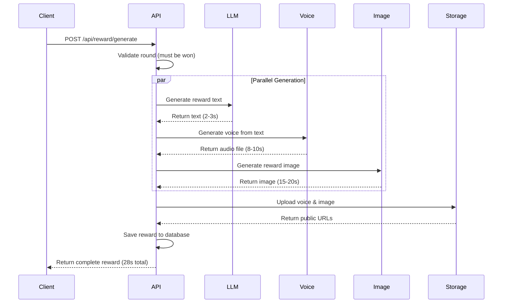

# Reward API Contract

**Version:** 1.0  
**Last Updated:** October 23, 2025  
**Base URL:** `/api/reward`

---

## Overview

Reward generation endpoints for creating text, voice, and image rewards when users win conversation rounds.

---

## Endpoints

### 1. Generate Complete Reward

**Endpoint:** `POST /api/reward/generate`  
**Purpose:** Generate all reward assets (text, voice, image) for a won round  
**Authentication:** Required (Bearer token)

#### Request

```typescript
interface GenerateRewardRequest {
  roundId: string;  // UUID, required
}
```

**Validation Rules:**
- `roundId`: Required, valid UUID
- Round must exist and have result = 'win'
- Round must belong to authenticated user

**Example Request:**
```json
{
  "roundId": "round_7c9e6679-7425-40de-944b-e07fc1f90ae7"
}
```

#### Response (200 OK)

```typescript
interface GenerateRewardResponse {
  rewardText: string;           // Flirtatious message (15-50 words)
  rewardVoiceUrl: string;       // Public URL to MP3 audio file
  rewardImageUrl: string;       // Public URL to reward image (lingerie photo)
  generationTime: number;       // Total generation time in seconds
  breakdown: {
    textGeneration: number;     // Seconds
    voiceGeneration: number;    // Seconds
    imageGeneration: number;    // Seconds
  };
}
```

**Example Response:**
```json
{
  "rewardText": "Mmm, you definitely know how to keep a girl interested... I might need to see if you're this charming face to face 😏",
  "rewardVoiceUrl": "https://storage.supabase.co/charmdojo/rewards/voice_abc123.mp3",
  "rewardImageUrl": "https://storage.supabase.co/charmdojo/rewards/image_abc123.jpg",
  "generationTime": 28.4,
  "breakdown": {
    "textGeneration": 2.1,
    "voiceGeneration": 8.3,
    "imageGeneration": 18.0
  }
}
```

#### Error Responses

**400 Bad Request - Invalid Round ID**
```json
{
  "error": "invalid_round_id",
  "message": "Round ID must be a valid UUID",
  "timestamp": "2025-10-23T10:30:00Z"
}
```

**403 Forbidden - Round Not Won**
```json
{
  "error": "round_not_won",
  "message": "Rewards can only be generated for won rounds",
  "roundResult": "lose",
  "timestamp": "2025-10-23T10:30:00Z"
}
```

**404 Not Found - Round Not Found**
```json
{
  "error": "round_not_found",
  "message": "Round with ID 'xyz' not found",
  "timestamp": "2025-10-23T10:30:00Z"
}
```

**409 Conflict - Reward Already Generated**
```json
{
  "error": "reward_already_exists",
  "message": "Reward has already been generated for this round",
  "existingReward": {
    "rewardText": "...",
    "rewardVoiceUrl": "...",
    "rewardImageUrl": "...",
    "createdAt": "2025-10-23T10:25:00Z"
  },
  "timestamp": "2025-10-23T10:30:00Z"
}
```

**500 Internal Server Error - Text Generation Failed**
```json
{
  "error": "text_generation_failed",
  "message": "Failed to generate reward text after 3 attempts",
  "timestamp": "2025-10-23T10:30:00Z"
}
```

**500 Internal Server Error - Voice Generation Failed**
```json
{
  "error": "voice_generation_failed",
  "message": "Failed to generate reward voice",
  "fallback": "text_only_reward",
  "partialReward": {
    "rewardText": "...",
    "rewardVoiceUrl": null,
    "rewardImageUrl": null
  },
  "timestamp": "2025-10-23T10:30:00Z"
}
```

**500 Internal Server Error - Image Generation Failed**
```json
{
  "error": "image_generation_failed",
  "message": "Failed to generate reward image after 3 attempts",
  "reason": "nsfw_content_detected",
  "fallback": "using_fallback_image",
  "partialReward": {
    "rewardText": "...",
    "rewardVoiceUrl": "...",
    "rewardImageUrl": "https://storage.supabase.co/charmdojo/fallback_reward.jpg"
  },
  "timestamp": "2025-10-23T10:30:00Z"
}
```

**503 Service Unavailable - AI Service Down**
```json
{
  "error": "ai_service_unavailable",
  "message": "Reward generation service is temporarily unavailable",
  "retryAfter": 60,
  "timestamp": "2025-10-23T10:30:00Z"
}
```

**504 Gateway Timeout - Generation Timeout**
```json
{
  "error": "generation_timeout",
  "message": "Reward generation took too long and was cancelled",
  "timeout": 60,
  "timestamp": "2025-10-23T10:30:00Z"
}
```

---

### 2. Get Existing Reward

**Endpoint:** `GET /api/reward/{roundId}`  
**Purpose:** Retrieve previously generated reward for a round  
**Authentication:** Required (Bearer token)

#### Request

**Path Parameters:**
- `roundId` (string, UUID): The round identifier

#### Response (200 OK)

```typescript
interface RewardResponse {
  id: string;                // Reward UUID
  roundId: string;
  rewardText: string;
  rewardVoiceUrl: string;
  rewardImageUrl: string;
  generationTime: number;
  createdAt: string;         // ISO 8601
}
```

**Example Response:**
```json
{
  "id": "reward_550e8400-e29b-41d4-a716-446655440000",
  "roundId": "round_7c9e6679-7425-40de-944b-e07fc1f90ae7",
  "rewardText": "You definitely know how to keep a girl interested... 😏",
  "rewardVoiceUrl": "https://storage.supabase.co/charmdojo/rewards/voice_abc123.mp3",
  "rewardImageUrl": "https://storage.supabase.co/charmdojo/rewards/image_abc123.jpg",
  "generationTime": 28.4,
  "createdAt": "2025-10-23T10:25:00Z"
}
```

#### Error Responses

**404 Not Found - Round Not Found**
```json
{
  "error": "round_not_found",
  "message": "Round with ID 'xyz' not found",
  "timestamp": "2025-10-23T10:30:00Z"
}
```

**404 Not Found - Reward Not Generated**
```json
{
  "error": "reward_not_found",
  "message": "No reward has been generated for this round yet",
  "roundResult": "win",
  "suggestion": "Call POST /api/reward/generate to create reward",
  "timestamp": "2025-10-23T10:30:00Z"
}
```

**403 Forbidden - Not Round Owner**
```json
{
  "error": "forbidden",
  "message": "You don't have permission to access this reward",
  "timestamp": "2025-10-23T10:30:00Z"
}
```

---

### 3. Regenerate Reward Asset

**Endpoint:** `POST /api/reward/regenerate`  
**Purpose:** Regenerate a specific reward asset (text, voice, or image) if user is unsatisfied  
**Authentication:** Required (Bearer token)

#### Request

```typescript
interface RegenerateAssetRequest {
  roundId: string;                        // UUID, required
  assetType: 'text' | 'voice' | 'image';  // Required
  reason?: string;                         // Optional feedback
}
```

**Example Request:**
```json
{
  "roundId": "round_7c9e6679-7425-40de-944b-e07fc1f90ae7",
  "assetType": "image",
  "reason": "Image quality is poor"
}
```

#### Response (200 OK)

```typescript
interface RegenerateAssetResponse {
  assetType: 'text' | 'voice' | 'image';
  newAssetUrl?: string;       // For voice/image
  newAssetText?: string;      // For text
  generationTime: number;
  message: string;
}
```

**Example Response:**
```json
{
  "assetType": "image",
  "newAssetUrl": "https://storage.supabase.co/charmdojo/rewards/image_xyz789.jpg",
  "generationTime": 19.2,
  "message": "Image regenerated successfully"
}
```

#### Error Responses

**403 Forbidden - Premium Feature**
```json
{
  "error": "premium_feature_required",
  "message": "Reward regeneration is only available for Premium users",
  "upgradeUrl": "/pricing",
  "timestamp": "2025-10-23T10:30:00Z"
}
```

**429 Too Many Requests - Regeneration Limit**
```json
{
  "error": "regeneration_limit_reached",
  "message": "You can only regenerate each asset once per round",
  "limit": 1,
  "used": 1,
  "timestamp": "2025-10-23T10:30:00Z"
}
```

---

## Reward Generation Pipeline

### 1. Text Generation

**Service:** OpenAI GPT-4 or Claude Sonnet  
**Temperature:** 0.9 (high variety)  
**Max Tokens:** 75  
**Max Retries:** 3

**Prompt Template:** `src/prompts/reward_text_prompt.md`

**Requirements:**
- Length: 15-50 words
- Tone: Flirtatious, attracted, playful
- Content: SFW (no explicit language)
- Style: Natural, not cringy

**Safety Filter:**
- Run through content moderation API
- Reject if flagged as explicit
- Regenerate if too generic or repetitive

**Example Outputs:**
- ✅ "I haven't felt this excited talking to someone in ages... when can we continue this in person? 😏"
- ✅ "You definitely know how to keep a girl interested... I might need to see if you're this charming face to face"
- ❌ "That was nice." (Too short/boring)
- ❌ "Let's have sex" (Too explicit)

---

### 2. Voice Generation

**Service:** ElevenLabs (Premium) or PlayHT (Free tier)  
**Voice Profile:** Female, seductive, American accent  
**Format:** MP3, 128kbps  
**Max Duration:** 15 seconds

**Voice Settings:**
- Stability: 0.5
- Similarity: 0.75
- Style: 0.4 (moderate emotional range)

**Recommended Voice IDs:**
- ElevenLabs: `21m00Tcm4TlvDq8ikWAM` (Rachel - warm, seductive)
- PlayHT: `voice_id_here` (Similar female voice)

**Processing:**
1. Generate audio from reward text
2. Upload to Supabase Storage (`/rewards/voice_*.mp3`)
3. Make file publicly accessible
4. Return CDN URL

**Error Handling:**
- Retry up to 2 times on failure
- If all retries fail, return text-only reward
- Log failure for monitoring

---

### 3. Image Generation

**Service:** Google Imagen 4 Fast via Vertex AI  
**Resolution:** 512x768 (portrait)  
**Max Retries:** 3

**Prompt Template:** `src/prompts/reward_photo_prompt.md`

**Prompt Construction:**
```markdown
Generate a realistic, photorealistic image of the woman described below. 
The woman should be in a flirtatious, seductive pose wearing lingerie 
and looking seductively at the camera.

**Important Constraints:**
- Image must be SFW (Safe For Work)
- No nudity - lingerie must cover all private areas
- Tasteful and classy, not explicit

**Woman Description:**
{girl_description}

**Style Guidelines:**
- Photorealistic portrait photography
- Flattering lighting (boudoir style)
- Professional quality
- Confident, seductive facial expression
```

**Placeholder Substitution:**
- `{girl_description}` → Detailed description from round (generated by Vision AI)

**Safety Filtering:**
1. Use Google's built-in safety filters (block NSFW)
2. If flagged as NSFW, regenerate with stricter prompt
3. After 3 failed attempts, use fallback image

**Fallback Strategy:**
- Use pre-generated SFW reward images from `/public/fallback-images/rewards/`
- Select fallback based on girl's ethnicity/appearance
- Always log failures for improvement

**Processing:**
1. Substitute girl description in prompt
2. Call Imagen API with safety filters
3. Check response safety rating
4. Upload to Supabase Storage (`/rewards/image_*.jpg`)
5. Make file publicly accessible
6. Return CDN URL

---

## Generation Flow Diagram



---

## Status Codes Summary

| Code | Meaning | Usage |
|------|---------|-------|
| 200 | OK | Successful generation, retrieval, or regeneration |
| 400 | Bad Request | Invalid round ID, validation error |
| 401 | Unauthorized | Missing or invalid auth token |
| 403 | Forbidden | Round not won, premium feature required |
| 404 | Not Found | Round or reward not found |
| 409 | Conflict | Reward already exists |
| 429 | Too Many Requests | Regeneration limit reached |
| 500 | Internal Server Error | Generation failure |
| 503 | Service Unavailable | AI service down |
| 504 | Gateway Timeout | Generation timeout (>60s) |

---

## Rate Limiting

| Endpoint | Limit | Window |
|----------|-------|--------|
| `POST /generate` | 10 requests | 5 minutes per user |
| `GET /{roundId}` | 30 requests | 1 minute per user |
| `POST /regenerate` | 3 requests | 10 minutes per user |

---

## Integration Notes

### Backend Implementation

```typescript
// src/app/api/reward/generate/route.ts
import { createRouteHandlerClient } from '@supabase/auth-helpers-nextjs';
import { generateRewardText } from '@/lib/ai/reward-text';
import { generateRewardVoice } from '@/lib/ai/elevenlabs';
import { generateRewardImage } from '@/lib/ai/imagen';
import { uploadToStorage } from '@/lib/supabase/storage';

export async function POST(request: Request) {
  const startTime = Date.now();
  const { roundId } = await request.json();
  
  // 1. Validate user and round
  // 2. Check if reward already exists
  // 3. Retrieve girl description from round
  
  // 4. Generate all assets in parallel
  const [text, voice, image] = await Promise.allSettled([
    generateRewardText(),
    generateRewardVoice(text),
    generateRewardImage(girlDescription),
  ]);
  
  // 5. Handle failures gracefully
  // 6. Upload assets to storage
  // 7. Save reward to database
  // 8. Return response
  
  const generationTime = (Date.now() - startTime) / 1000;
  return Response.json({ rewardText, rewardVoiceUrl, rewardImageUrl, generationTime });
}
```

### Frontend Implementation

```typescript
// src/lib/api/reward.ts
import { useMutation } from '@tanstack/react-query';

export function useGenerateReward() {
  return useMutation({
    mutationFn: async (roundId: string) => {
      const response = await fetch('/api/reward/generate', {
        method: 'POST',
        headers: { 'Content-Type': 'application/json' },
        body: JSON.stringify({ roundId }),
      });

      if (!response.ok) {
        const error = await response.json();
        throw new Error(error.message);
      }

      return response.json();
    },
    retry: 2, // Retry twice on failure
    retryDelay: 3000, // 3 second delay between retries
  });
}

// Victory screen component
function VictoryScreen({ roundId }: { roundId: string }) {
  const { data, isLoading, error } = useGenerateReward();
  
  useEffect(() => {
    // Trigger generation on mount
    generateReward(roundId);
  }, [roundId]);
  
  if (isLoading) {
    return <RewardLoadingState />;
  }
  
  if (error) {
    return <RewardErrorState error={error} />;
  }
  
  return (
    <RewardDisplay
      text={data.rewardText}
      voiceUrl={data.rewardVoiceUrl}
      imageUrl={data.rewardImageUrl}
    />
  );
}
```

---

## Cost Estimates

### Per Reward Generation (Premium Tier)

| Asset | Service | Cost | Time |
|-------|---------|------|------|
| Text | GPT-4 Turbo | $0.01 | 2-3s |
| Voice | ElevenLabs | $0.01 | 8-10s |
| Image | Imagen 4 Fast | $0.04 | 15-20s |
| **Total** | | **$0.06** | **25-33s** |

### Per Reward Generation (Free Tier)

| Asset | Service | Cost | Time |
|-------|---------|------|------|
| Text | GPT-4 Turbo | $0.01 | 2-3s |
| Voice | PlayHT | $0.003 | 5-7s |
| Image | Imagen 4 Fast | $0.04 | 15-20s |
| **Total** | | **$0.053** | **22-30s** |

---

## Testing Checklist

### Happy Path
- [ ] Generate complete reward for won round
- [ ] All 3 assets generated successfully
- [ ] Assets uploaded to storage with public URLs
- [ ] Reward saved to database
- [ ] Response time under 35 seconds

### Validation
- [ ] Invalid round ID rejected (400)
- [ ] Round not found rejected (404)
- [ ] Round not won rejected (403)
- [ ] Duplicate generation rejected (409)

### Partial Failures
- [ ] Voice generation failure falls back to text-only
- [ ] Image generation failure uses fallback image
- [ ] Text generation retries up to 3 times

### Safety
- [ ] NSFW text regenerated automatically
- [ ] NSFW image regenerated automatically
- [ ] After 3 NSFW attempts, use fallback image
- [ ] Content moderation logs failures

### Performance
- [ ] Parallel generation faster than sequential
- [ ] Timeout at 60 seconds
- [ ] Graceful degradation on service failures
- [ ] Proper error messages for each failure type

### Premium Features
- [ ] Free tier gets PlayHT voice
- [ ] Premium tier gets ElevenLabs voice
- [ ] Regeneration blocked for free tier
- [ ] Regeneration allowed for premium (1x per asset)

